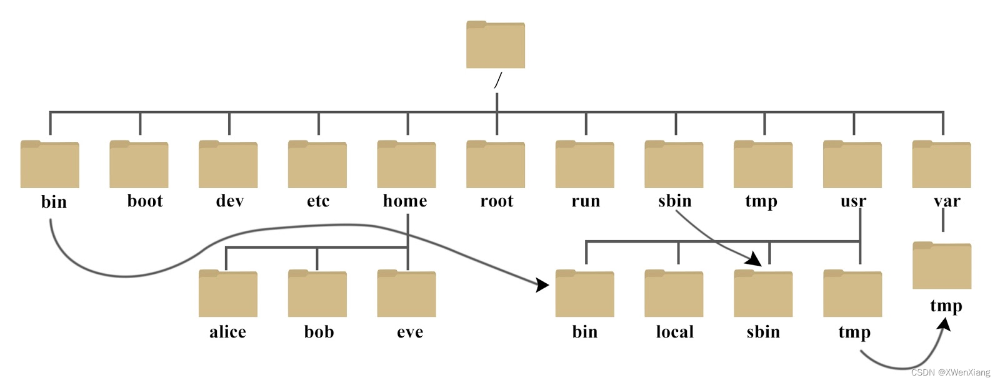

## Linux常见快捷键
- Tab：命令或路径的补全键
- ctrl+c：中断终端正在执行的任务或者删除整行
- ctrl+z：暂停在终端运行的任务
- cat ：在不打开图形文本编辑器的情况下预览文件
- ls ：查看目录（文件夹）中的文件
- vi/vim：文本编辑
- cd：进入制定目录
- touch: 创建文件

# 为社么项目部署要选择Linux操作系统
Linux：免费+图形化/非图形化界面
Windows：收费+图形化界面慢

# Linux和Windows系统目录结构对比

- Windows
	- Program Files： 存放系统软件，平时软件安装时，默认的安装路径，个人不建议将应用软件装到系统盘。
	- Program File (x86) ：32位软件，与 Program File 类似，只是其主要存放32位的软件。
	- Windows：  系统级目录，该目录是 Windows 操作系统的主要文件存放的目录。
	- ProgramData： 软件数据，存放 Windows系统中软件的系统级配置文件。
	- 用户/User ：普通账户的目录，普通账户的所有文件，包括桌面、应用数据、下载等等。

- Linux
	- /  根目录，系统的最顶层目录
	- 系统启动必须：
		- /boot：存放的启动Linux 时使用的内核文件，包括连接文件以及镜像文件。
		- /etc：存放所有的系统需要的配置文件和子目录列表，更改目录下的文件可能会导致系统不能启动。
		- /lib：存放基本代码库（比如c++库），其作用类似于Windows里的DLL文件。几乎所有的应用程序都需要用到这些共享库。
		- /sys： 这是linux2.6内核的一个很大的变化。该目录下安装了2.6内核中新出现的一个文件系统 sysfs 。sysfs文件系统集成了下面3种文件系统的信息：针对进程信息的proc文件系统、针对设备的devfs文件系统以及针对伪终端的devpts文件系统。该文件系统是内核设备树的一个直观反映。当一个内核对象被创建的时候，对应的文件和目录也在内核对象子系统中
	- 指令集合：
		- /bin：存放着最常用的程序和指令
		- /sbin：只有系统管理员能使用的程序和指令。
	- 外部文件管理：
		- /dev ：Device(设备)的缩写, 存放的是Linux的外部设备。注意：在Linux中访问设备和访问文件的方式是相同的。
		- /media：类windows的其他设备，例如U盘、光驱等等，识别后linux会把设备放到这个目录下。
		- /mnt：临时挂载别的文件系统的，我们可以将光驱挂载在/mnt/上，然后进入该目录就可以查看光驱里的内容了。
	- 临时文件：
		- /run：是一个临时文件系统，存储系统启动以来的信息。当系统重启时，这个目录下的文件应该被删掉或清除。如果你的系统上有 /var/run 目录，应该让它指向 run。
		- /lost+found：一般情况下为空的，系统非法关机后，这里就存放一些文件。
		- /tmp：这个目录是用来存放一些临时文件的。
	- 账户：
		- /root：系统管理员的用户主目录。
		- /home：用户的主目录，以用户的账号命名的。
		- /usr：用户的很多应用程序和文件都放在这个目录下，类似于windows下的program files目录。
		- /usr/bin：系统用户使用的应用程序与指令。
		- /usr/sbin：超级用户使用的比较高级的管理程序和系统守护程序。
		- /usr/src：内核源代码默认的放置目录。
	- 运行过程中要用：
		- /var：存放经常修改的数据，比如程序运行的日志文件（/var/log 目录下）。
		- /proc：管理内存空间！虚拟的目录，是系统内存的映射，我们可以直接访问这个目录来，获取系统信息。这个目录的内容不在硬盘上而是在内存里，我们也可以直接修改里面的某些文件来做修改。
	- 扩展用的：
		- /opt：默认是空的，我们安装额外软件可以放在这个里面。
		- /srv：存放服务启动后需要提取的数据（不用服务器就是空）

- 关系
	- 普通用户的主目录
		- /home == C:\User； /home /xxx == C:\User\xxx