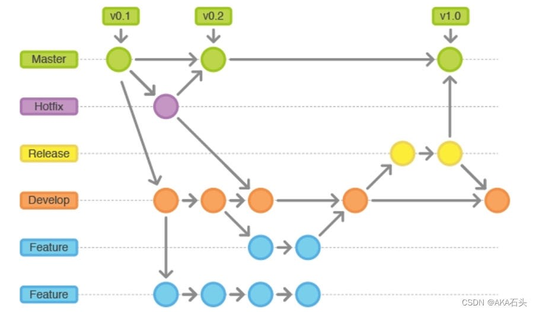

# Git原理（GitPython/PyGithub）

在 Git 版本控制系统中， 使用的是一种称为“提交对象”的数据结构来存储代码历史记录。

## 提交（状态变更）（commit_id）
commit_id 是一个 Git 版本控制系统中的概念，它是一个由 40 个十六进制字符组成的字符串，用于唯一标识一次代码提交，代表了一个代码库在某个时间点上的状态。在 Git 中，每次提交（发生变更的操作，代码库状态发生改变，git commit/tag/rebase/merge/release）都会生成一个唯一的 commit_id，它由 Git 系统根据提交的内容计算得出。commit_id 可以用于在 Git 中查找特定的提交记录，也可以用于版本控制、代码回滚等操作。在 Git 中，我们可以使用 git log 命令查看所有的代码提交记录，并查看每个提交的 commit_id。

## 提交（包括commit/merge等）规范
- Title(type:subject)
	- feat：新增功能
	- fix：bug 修复
	- docs：文档更新
	- style：不影响程序逻辑的代码修改(修改空白字符，格式缩进，补全缺失的分号等，没有改变代码逻辑)
	- refactor：重构代码(既没有新增功能，也没有修复 bug)
	- perf：性能, 体验优化
	- test：新增测试用例或是更新现有测试
	- build：主要目的是修改项目构建系统(例如 glup，webpack，rollup 的配置等)的提交
	- ci：主要目的是修改项目继续集成流程(例如 Travis，Jenkins，GitLab CI，Circle等)的提交
	- chore：不属于以上类型的其他类，比如构建流程, 依赖管理
	- revert：回滚某个更早之前的提交

### 例子：
- feat: 添加用户登录功能
- Description:
	- 为用户添加了登录功能，使用了 OAuth 2.0 协议进行验证。
	- Closes #123
		- Closes #问题编号：使用这个格式可以在合并 MR 时关闭单个问题。
	- Closes #123, #124
		- Closes #问题编号, Closes #另一个问题编号：使用逗号分隔多个问题编号，可以在合并 MR 时关闭多个问题。

## 分支（branch）
 
在 Git 版本控制系统中，分支是指向某个特定提交（commit）的指针，指向你当前工作分支的最新的那个提交。每当你进行一次提交，Git 就会自动创建一个指向该提交的分支。如果你在某个分支上进行修改并提交，那么该分支的指针就会向前移动，指向新的提交。HEAD（头结点）指向当前工作的分支，即 HEAD 是当前分支的一个引用，如果切换了分支，HEAD 随之更新。分支的commit_id是最新提交（或发生其他操作）的commit_id
### 为什么某个commit_id 会属于多个分支
- 一个commit_id可以在多个分支上存在，这是因为在Git中分支是指向某个commit的指针。如果一个分支指向的commit与另一个分支指向的commit是相同的，那么这两个分支就共享这个commit。一个commit_id属于多个分支通常发生在从一个父分支创建的情况下。
 
- 在这个分支结构中，commit C 是 master 和 feature1 分支的共同祖先，而 commit H 是 feature1 和 feature2 分支的共同祖先。因此，commit C 和 commit H 都属于多个分支。
## tag（标签）
Tag 是 Git 中的一个轻量级标签，它可以被用来标记某个特定的提交。通常情况下，我们会在代码库中的重要节点上打上 tag，比如在发布一个版本时，或者在代码库中的某个重要的里程碑上。对某个提交(某个状态)或分支打 tag 之后，将固定指向那个提交（状态），后续即使分支有更新甚至删除，tag 所指向的提交不变，且一直存在。tag的commit_id是不变的。当你在某个commit上创建一个tag时，这个tag就会指向该commit。

## 状态变更操作
- Commit：有一个commit_commit_id
- Merge:有一个merge_commit_id，
- Release:发布某个版本的代码。当我们创建一个 release 时(有一个release_commit_id)，Git 会将代码库中的某个特定提交打包成一个压缩文件，并将其发布到 GitHub 等 Git 托管服务上。同时，我们还可以在 release 中添加一些描述信息，比如版本号、发布日期、更新内容等。release 是基于 tag 的，也就是说，我们在发布一个版本时，通常会先在代码库中打上一个 tag(tag_commit_id)，然后再将该 tag 对应的提交打包成一个 release 进行发布。

### 为什么PR包含的commit_id中没有PR或MR合并时的commit_id?
一旦贡献者发起PR，就会有一个PR链接，这个PR链接对应的PR可能是open（未合并）或merged（已经合并）状态，若已经合并，就会产生一个merge_commit_id,通常情况下，PR链接中包含的commit_id是指该PR中所包含的所有单个提交的commit_id，而不是合并提交的merge_commit_id。因为merge_commit_id是合并操作的结果，它包含了多个父提交的信息。合并提交的commit_id通常可以在合并后的分支或者标签上找到。

## PR合并的方式
- merge（合并所有提交）：这是最常见的合并方式，它会将源分支（通常是一个 PR 分支）的更改合并到目标分支（通常是主分支）中，并创建一个新的合并提交。这种方式会保留所有提交历史，并且可以轻松地撤销合并。但是，由于它会创建新的提交，因此会使提交历史变得复杂。
- squash（扁平化分支合并）：这种方式会将源分支的所有提交压缩成一个提交，并将其合并到目标分支中。这种方式会使提交历史变得更加简洁，但是会丢失源分支中的提交历史。此外，由于它会创建新的提交，因此也会使提交历史变得复杂。
- rebase（变基并合并）：这种方式会将源分支的提交移动到目标分支的末尾，并创建一个新的合并提交。这种方式可以保留所有提交历史，并且可以使提交历史保持线性，但是需要注意的是，它会改变源分支中的提交历史，并且可能会导致冲突。
- 当一个 PR 被合并时，它所包含的提交会被合并到目标分支中，而不是源分支中。也就是说，合并后的提交包含在目标分支中，而不是源分支中。如果您想查找合并后的提交的 SHA 值，您应该查询目标分支，而不是源分支。

### 为什么PR包含的commit_id 不是仓库任何分支（的祖先）?
- PR 包含的commit_id一般在源分支上，这个分支一般是自己的本地分支；
- 如果采用merge的PR合并方式，那么pr_commit_id就会同步到远程仓库的目标分支上，那么pr_commit_id就可以查询到相关的信息，就应该是仓库一个或多个分支的祖先；
- 如果采用squash或者rebase的PR合并方式，那么pr_commit_id就不会同步到远程仓库的目标分支上，那么就查询不到pr_commit_id相关的信息，也就不是仓库一个或多个分支的祖先。
- 为什么PR合并的commit_id 不是仓库任何分支（的祖先）?
- 一般而言，只要PR合并，就会产生一个merge_commit_id，这个merge_commit_id在远程某个分支（即目标分支上），如何merge_commit_id不在任何分支（不是任何远程分支的祖先），那么可能合并时的目标分支已经被删除

## git命令

两个工具：Sourcetree（查看分支与提交）、kDiff3（查看冲突解决冲突）

- SSH生成公私钥（平台和gitlab都得添加公钥）

	- ssh-keygen -t rsa -C wenqiang@nj.iscas.ac.cn
	- 将~/.ssh/id_rsa.pub或C:\Users\Administrator\.ssh\id_rsa.pub复制到gitlab/github/gitee仓库的ssh公钥
	- git config --global user.name "nickname"
	- git config --global user.email "email"

这样配置之后，我在windows本地就有权限在我本地往这个gitlab仓库进行拉取和推送

- 远程仓库克隆到本地，当仓库地址支持 SSH 方式时
	- git clone git@gitee.com:xxx/python_study.git
- 远程仓库克隆到本地，当仓库地址支持 HTTPS 方式时
	- git clone https://gitee.com/xxx/python_study.git
- 要克隆远程仓库的某个分支到本地，可以使用以下命令：
	- git clone -b 分支名 仓库地址
	- 其中，分支名 是要克隆的分支的名称，仓库地址是远程仓库的 URL。
- 列出所有本地分支
	- git branch
- 列出所有远程分支
	- git branch -r
- 列出所有本地分支和远程分支
	- git branch -a
- 切换分支，切换到wenqiang分支
	- git checkout wenqiang
- 创建本地分支并切换到新建分支
	- git checkout -b wenqiang
- wenqiang分支合并到main分支
	- git checkout mian
	- git merge --no-ff wenqiang
- 删除分支
	- git branch -d wenqiang
- 取回远程主机某个分支的更新，再与本地的指定分支合并
	- git pull <远程主机名> <远程分支名>:<本地分支名>
	- git pull origin main:wenqiang
		- 取回origin主机的main分支，与本地的wenqiang分支合并
		- git pull  =  git fetch + git merge
	- 把远程仓库中的更新合并到本地库中，–rebase的作用是取消本地库中的commit，并接到新版本库中
		- git pull --rebase origin main
- 显示当前分支的最近几次提交
	- git reflog
- 显示当前分支的版本历史
	- git log
- 将该文件添加到暂存区
	- git add -A  提交所有变化
	- git add -u  提交被修改(modified)和被删除(deleted)文件，不包括新文件(new)
	- git add .  提交新文件(new)和被修改(modified)文件，不包括被删除(deleted)文件
- 显示有变更的文件
	- git status
- 将暂存区内容添加到本地仓库中
	- git commit -m [message]
- 将本地的master分支和远程next分支进行关联
	- git branch --set-upstream master origin/next
	- 在某些场合，Git会自动在本地分支与远程分支之间，建立一种追踪关系(tracking)。比如，在git clone的时候，本地分支默认与远程主机的同名分支，建立追踪关系，也就是说，本地的master分支自动”追踪”origin/master分支。
- 将本地的分支版本上传到远程并合并
	- git push <远程主机名> <本地分支名>:<远程分支名>
- 隐藏当前的工作现场, 此时, git status的结果是 clean
	- git stash save “test1”
	- git pull origin master 
	- git stash list # 查看所有隐藏, 每一行的冒号前面的字符串就是标识此隐藏的id
	- git stash apply stash名字（如stash@{1}）# 重新显示标识为 id 的隐藏
	- git stash pop # 恢复最新的进度到工作区
	- git stash pop stash名字（如stash@{1}） # 恢复指定的进度到工作区

- 别人上传到远程仓库后，你没有及时的同步（拉取）到本地，但是你同时又添加了一些内容（提交），以致于你在提交时，它会检测到你之前从远程仓库拉取的时候的仓库状态和现在的不一样。于是，它为了安全起见拒绝了你的提交（然后就报了error: failed to push some refs to这个错误）。
	- git pull origin master --allow-unrelated-histories

## git如何避免”warning: LF will be replaced by CRLF“提示？

这是因为目前的Git仓库由于跨操作系统操作而引发了部分文件的换行符转换问题。具体来说，Linux、macOS、Windows操作系统对于文本文件的换行符有不同的标准，因此一个文件如果与上次操作的系统环境不同，Git自然会在文件对比时识别到标识符被修改，从而引发提示。LF和CR字符在不同的操作系统中被用作操作符，其中LF（0x0A, \n）的初始定义是将光标从当前位置下移一行，不涉及移动到该行行首位置的动作，而CR（0x0D, \r）的原始含义则是将光标前移到当前行的行首，不涉及下移的动作。Linux系操作系统（含macOS，虽然它在OSX时期曾经使用过CR）使用LF直接表示光标换行+移到行首；Windows组合使用了CRLF（0x0D 0x0A, \r\n），无疑是符合标准语义的做法。

尽管这不是一个Bug或错误，但还是可以通过如下方式对Git进行配置，以避免在每次提交代码时显示：
#### Linux/macOS系统下在提交代码时自动将CRLF转换为LF
- git config --global core.autocrlf input

#### Windows系统下在提交代码时自动将LF转换为CRLF
- 将Git的core.autocrlf配置设置为true，这将自动将行尾换行符转换为操作系统默认的换行符
	- git config --global core.autocrlf true

## 解决git push报警告 TLS certificate verification has been disabled! 
重启安全认证,执行：git config --global http.sslVerify true

## 如何把本地项目上传到github？

- 1、在本地创建一个版本库（即文件夹），通过git init把它变成Git仓库；
- 2、把项目复制到这个文件夹里面，再通过git add .把项目添加到仓库；
- 3、再通过git commit -m "注释内容"把项目提交到仓库；
- 4、在Github上设置好SSH密钥后，新建一个远程仓库，通过git remote add origin https://github.com/guyibang/TEST2.git将本地仓库和远程仓库进行关联；
	- 在本地目录下关联远程repository ：
		- git remote add origin https://gitee.com/xxx/python_study.git
	- 取消本地目录下关联的远程库：
		- git remote remove origin
- 5、最后通过git push -u origin master把本地仓库的项目推送到远程仓库（也就是Github）上；
	- 由于新建的远程仓库是空的，所以要加上-u这个参数
	- 若新建远程仓库的时候自动创建了README文件会报错，解决：
		- git pull --rebase origin master，然后再push
	- 文件过大报错，http.postBuffer默认上限为1M,所以将上限改大就行需要将上限改大。解决方案为：
		- git config --global http.postBuffer 524288000

# 当本地新建一个分支第一次pull，git中出现“non-fast-forward”errors时的终极解决方案
- git pull origin master --allow-unrelated-histories

##  Pycharm 中的 Git 操作 

## git 远程仓库两种协议连接
- ssh协议连接（好处是不需要每次输入密码）
	- git remote -v（查看当前远程仓库使用的那种协议连接）
	- git remote add origin git@github.com:unlimitbladeworks/Data-Struts-Learning.git（添加ssh协议的远程仓库）
	- git remote rm origin（查看当前远程仓库使用的那种协议连接）
- https协议连接
	- git remote add origin https://github.com/unlimitbladeworks/Data-Struts-Learning.git（添加https协议的远程仓库）