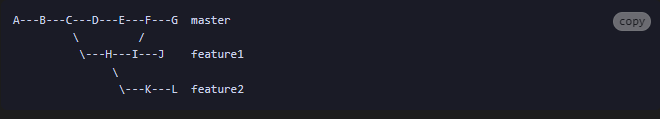

# Git原理（GitPython/PyGithub）

在 Git 版本控制系统中， 使用的是一种称为“提交对象”的数据结构来存储代码历史记录。

## 提交（状态变更）（commit_id）
commit_id 是一个 Git 版本控制系统中的概念，它是一个由 40 个十六进制字符组成的字符串，用于唯一标识一次代码提交，代表了一个代码库在某个时间点上的状态。在 Git 中，每次提交（发生变更的操作，代码库状态发生改变，git commit/tag/rebase/merge/release）都会生成一个唯一的 commit_id，它由 Git 系统根据提交的内容计算得出。commit_id 可以用于在 Git 中查找特定的提交记录，也可以用于版本控制、代码回滚等操作。在 Git 中，我们可以使用 git log 命令查看所有的代码提交记录，并查看每个提交的 commit_id。

## 分支（branch） 
在 Git 版本控制系统中，分支是指向某个特定提交（commit）的指针，指向你当前工作分支的最新的那个提交。每当你进行一次提交，Git 就会自动创建一个指向该提交的分支。如果你在某个分支上进行修改并提交，那么该分支的指针就会向前移动，指向新的提交。HEAD（头结点）指向当前工作的分支，即 HEAD 是当前分支的一个引用，如果切换了分支，HEAD 随之更新。分支的commit_id是最新提交（或发生其他操作）的commit_id
### 为什么某个commit_id 会属于多个分支
- 一个commit_id可以在多个分支上存在，这是因为在Git中分支是指向某个commit的指针。如果一个分支指向的commit与另一个分支指向的commit是相同的，那么这两个分支就共享这个commit。一个commit_id属于多个分支通常发生在从一个父分支创建的情况下。
 
- 在这个分支结构中，commit C 是 master 和 feature1 分支的共同祖先，而 commit H 是 feature1 和 feature2 分支的共同祖先。因此，commit C 和 commit H 都属于多个分支。
## tag（标签）
Tag 是 Git 中的一个轻量级标签，它可以被用来标记某个特定的提交。通常情况下，我们会在代码库中的重要节点上打上 tag，比如在发布一个版本时，或者在代码库中的某个重要的里程碑上。对某个提交(某个状态)或分支打 tag 之后，将固定指向那个提交（状态），后续即使分支有更新甚至删除，tag 所指向的提交不变，且一直存在。tag的commit_id是不变的。当你在某个commit上创建一个tag时，这个tag就会指向该commit。

## 状态变更操作
- Commit：有一个commit_commit_id
- Merge:有一个merge_commit_id，
- Release:发布某个版本的代码。当我们创建一个 release 时(有一个release_commit_id)，Git 会将代码库中的某个特定提交打包成一个压缩文件，并将其发布到 GitHub 等 Git 托管服务上。同时，我们还可以在 release 中添加一些描述信息，比如版本号、发布日期、更新内容等。release 是基于 tag 的，也就是说，我们在发布一个版本时，通常会先在代码库中打上一个 tag(tag_commit_id)，然后再将该 tag 对应的提交打包成一个 release 进行发布。

### 为什么PR包含的commit_id中没有PR或MR合并时的commit_id?
一旦贡献者发起PR，就会有一个PR链接，这个PR链接对应的PR可能是open（未合并）或merged（已经合并）状态，若已经合并，就会产生一个merge_commit_id,通常情况下，PR链接中包含的commit_id是指该PR中所包含的所有单个提交的commit_id，而不是合并提交的merge_commit_id。因为merge_commit_id是合并操作的结果，它包含了多个父提交的信息。合并提交的commit_id通常可以在合并后的分支或者标签上找到。

### 为什么PR包含的commit_id 不是仓库任何分支（的祖先）?
- PR 包含的commit_id一般在源分支上，这个分支一般是自己的本地分支；
- 如果采用merge的PR合并方式，那么pr_commit_id就会同步到远程仓库的目标分支上，那么pr_commit_id就可以查询到相关的信息，就应该是仓库一个或多个分支的祖先；
- 如果采用squash或者rebase的PR合并方式，那么pr_commit_id就不会同步到远程仓库的目标分支上，那么就查询不到pr_commit_id相关的信息，也就不是仓库一个或多个分支的祖先。
- 
### 为什么PR合并的commit_id 不是仓库任何分支（的祖先）?
- 一般而言，只要PR合并，就会产生一个merge_commit_id，这个merge_commit_id在远程某个分支（即目标分支上），如何merge_commit_id不在任何分支（不是任何远程分支的祖先），那么可能合并时的目标分支已经被删除

## git如何避免”warning: LF will be replaced by CRLF“提示？

这是因为目前的Git仓库由于跨操作系统操作而引发了部分文件的换行符转换问题。具体来说，Linux、macOS、Windows操作系统对于文本文件的换行符有不同的标准，因此一个文件如果与上次操作的系统环境不同，Git自然会在文件对比时识别到标识符被修改，从而引发提示。LF和CR字符在不同的操作系统中被用作操作符，其中LF（0x0A, \n）的初始定义是将光标从当前位置下移一行，不涉及移动到该行行首位置的动作，而CR（0x0D, \r）的原始含义则是将光标前移到当前行的行首，不涉及下移的动作。Linux系操作系统（含macOS，虽然它在OSX时期曾经使用过CR）使用LF直接表示光标换行+移到行首；Windows组合使用了CRLF（0x0D 0x0A, \r\n），无疑是符合标准语义的做法。

尽管这不是一个Bug或错误，但还是可以通过如下方式对Git进行配置，以避免在每次提交代码时显示：
#### Linux/macOS系统下在提交代码时自动将CRLF转换为LF
- git config --global core.autocrlf input

#### Windows系统下在提交代码时自动将LF转换为CRLF
- 将Git的core.autocrlf配置设置为true，这将自动将行尾换行符转换为操作系统默认的换行符
	- git config --global core.autocrlf true

## 解决git push报警告 TLS certificate verification has been disabled! 
重启安全认证,执行：git config --global http.sslVerify true

## 如何把本地项目上传到github？

- 1、在本地创建一个版本库（即文件夹），通过git init把它变成Git仓库；
- 2、把项目复制到这个文件夹里面，再通过git add .把项目添加到仓库；
- 3、再通过git commit -m "注释内容"把项目提交到仓库；
- 4、在Github上设置好SSH密钥后，新建一个远程仓库，通过git remote add origin https://github.com/guyibang/TEST2.git将本地仓库和远程仓库进行关联；
	- 在本地目录下关联远程repository ：
		- git remote add origin https://gitee.com/xxx/python_study.git
	- 取消本地目录下关联的远程库：
		- git remote remove origin
- 5、最后通过git push -u origin master把本地仓库的项目推送到远程仓库（也就是Github）上；
	- 由于新建的远程仓库是空的，所以要加上-u这个参数，u是upstream的缩写
	- 若新建远程仓库的时候自动创建了README文件会报错，解决：
		- git pull --rebase origin master，然后再push
	- 文件过大报错，http.postBuffer默认上限为1M,所以将上限改大就行需要将上限改大。解决方案为：
		- git config --global http.postBuffer 524288000

# 当本地新建一个分支第一次pull，git中出现“non-fast-forward”errors时的终极解决方案
- git pull origin master --allow-unrelated-histories

##  Pycharm 中的 Git 操作 

## git 远程仓库两种协议连接
- ssh协议连接（好处是不需要每次输入密码）
	- git remote -v（查看当前远程仓库使用的那种协议连接）
	- git remote add origin git@github.com:unlimitbladeworks/Data-Struts-Learning.git（添加ssh协议的远程仓库）
	- git remote rm origin（删除当前远程仓库使用的这种协议连接）
- https协议连接
	- git remote add origin https://github.com/unlimitbladeworks/Data-Struts-Learning.git（添加https协议的远程仓库）

## 版本回退
- git reset

## 合并分支（将不同的修改内容整合到一起）的两种方式
- 比如我想要本地的dev分支和main分支整合到一起
	- 法一：
		- git switch main
		- git merge dev
	- git rebase

## git提交或克隆报错fatal: unable to access ‘https://git

这说明你采用http协议与远程仓库进行通信（clone、push、pull）但是这个协议出现了问题，主要时网络问题
- //查看git当前设置
	- git config --global -l 
- //取消http代理（关闭梯子，Giee有效加快速度）
	- git config --global --unset http.proxy
- //取消https代理（关闭梯子，Giee有效加快速度）
	- git config --global --unset https.proxy

- 设置代理（打开梯子，Github有效加快速度）
	- git config --global http.proxy http://127.0.0.1:10809

