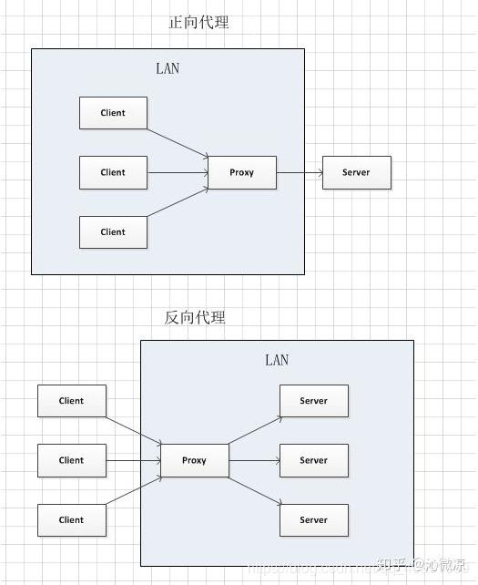
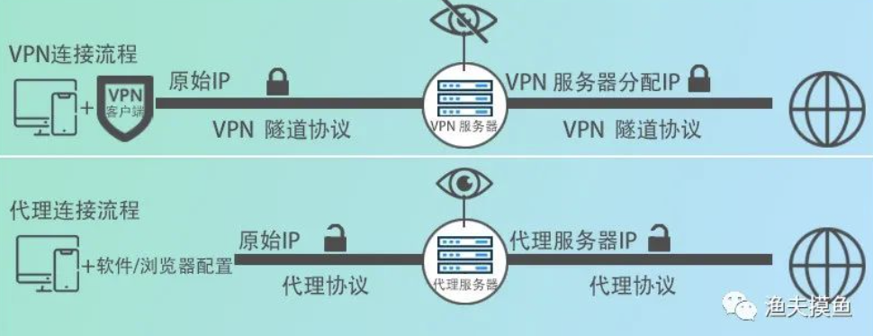

## 利用代理访问内网和服务器
- SSH生成公私钥（平台和gitlab都得添加）
- git config --global user.name "wenqiang"
- git config --global user.email "wenqiang@nj.iscas.ac.cn"
- ssh-keygen -t rsa -C wenqiang@nj.iscas.ac.cn
- 将~/.ssh/id_rsa.pub或C:\Users\Administrator\.ssh\id_rsa.pub复制到gitlab

- 访问内网
	- 在C:\Users\Administrator\.ssh\config文件设置跳板
	```
	Host tiaoban
	    Hostname isrc.iscas.ac.cn
	    Port 5022
	    User wenqiang
	```
	- 在cmd输入：ssh -fCND 127.0.0.1:1081 -p 5022 tiaoban

- 访问内网中的服务器
	- 在C:\Users\Administrator\.ssh\config文件设置跳板
	```
	Host server
	    HostName 192.168.19.78
	    Port 22
	    User wenqiang
	    ProxyCommand ssh tiaoban -W %h:%p
	```
	```
	Host auto_ci
	    Hostname 192.168.19.78
	    Port 22
	    User wenqiang
	    ProxyCommand ssh -p 5022 wenqiang@isrc.iscas.ac.cn -W %h:%p
	 	IdentityFile C:/Users/Administrator/.ssh/id_rsa
	```
	- 在cmd输入：ssh -fCNL 127.0.0.1:31459:192.168.19.78:31459 tiaoban


# 代理服务器http(s)和socks5的区别
- 代理IP根据协议类型分为HTTP代理，HTTPS代理和SOCKS5（SOCKS代理的升级版）代理三种，它们都是目前较为常用的代理IP的协议类型。
- HTTP代理和HTTPS代理主要用于代理HTTP和HTTPS流量，而SOCKS代理是一种通用的代理协议，可以代理各种协议的流量。
- HTTP代理和HTTPS代理更适合用于Web浏览器和HTTP/HTTPS应用程序的代理设置，而SOCKS代理更适合用于网络层的代理需求。


# 正向代理和反向代理
- 代理就相当于中间商,本来A和B是可以直接连接的,但是此时添加了一个C在中间,A跟B不直接连接,而是通过C作为中介进行连接。
- 一个完整的请求是由: client(客户端) -> proxy(代理) -> server(服务端) 组成。



- 正向代理（卖票的黄牛）
	- 正向代理即是客户端代理, 代理客户端, 服务端不知道实际发起请求的客户端。正向代理中，proxy和client同属一个LAN，对server透明；正向代理隐藏了真实的客户端地址。可以很好地保护客户端的安全性。
	- 正向代理时，由客户端发送对某一个目标服务器的请求，代理服务器在中间将请求转发给该目标服务器，目标服务器将结果返回给代理服务器，代理服务器再将结果返回给客户端。使用正向代理时，**客户端是需要配置代理服务的地址、端口、账号密码（如有）等才可使用的**。
	- 举例： 如我们现在想要访问谷歌,但是由于某些原因,无法直接访问到谷歌,我们可以通过连接一台代理服务器,代理服务将我们的请求提交到谷歌,然后再将谷歌的响应反馈给我们,对于谷歌而言,它只知道有一个请求过来,但是它并不会知道我们是无法直接访问它的。
	- 正向代理的作用:
		1. 访问原来无法访问的资源，如google
		2. 可以做缓存，加速访问资源
		3. 对客户端访问授权，上网进行认证
		4. 代理可以记录用户访问记录（上网行为管理），对外隐藏用户信息

- 反向代理（出租房的二手东）
	- 反向代理即是服务端代理, 代理服务端, 客户端不知道实际提供服务的服务端。反向代理中，proxy和server同属一个LAN，对client透明。
	- 反向代理整个流程：由客户端发起对代理服务器的请求，代理服务器在中间将请求转发给某一个服务器，服务器将结果返回给代理服务器，代理服务器再将结果返回给客户端。
	- 举例: 比如我们访问百度网站，百度的代理服务器对外的域名为 https://www.baidu.com 。具体内部的服务器节点我们不知道。现实中我们通过访问百度的代理服务器后，代理服务器给我们转发请求到他们N多的服务器节点中的一个给我们进行搜索后将结果返回,此时,代理服务器对我们客户端来说就充当了提供响应的服务器,但是对于目标服务器来说,它只是进行了一个请求和转发的功能。
	- 反向代理的作用:
		1. 保证内网的安全，阻止web攻击，大型网站，通常将反向代理作为公网访问地址，Web服务器是内网。
		2. 负载均衡，通过反向代理服务器来优化网站的负载。


- VPN只是代理服务器中的一种形式，VPN是一种典型的正向代理，一般的代理是处理内部网络访问外部网络问题，VPN大多是解决外部网络访问内部网络问题
- 与代理一样，虚拟专用网络充当中间人，使用户看起来像是从不同的地理位置访问互联网。VPN不是从浏览器设置的，而是在操作系统内部设置的。这使VPN能够处理所有流量。


