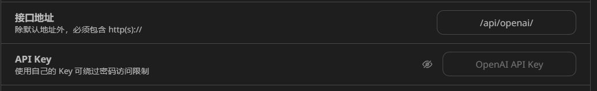
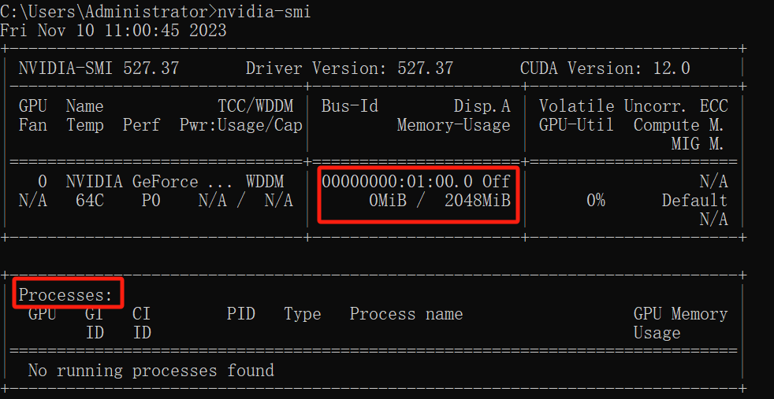

# 8、人工智能
- 机器学习：人工智能的基础
- 神经网络：人工智能的构建模块
- 数据：人工智能的燃料
- 算法：人工智能的问题解决者
- 人工智能流程：
	- 数据采集。收集供您使用的相关数据，并将其传递给培训程序以告知人工智能。
	- 数据预处理。检查数据集以删除错误数据、修复格式并确保信息保持更新。
	- 模型选择。选择最适合您需求的 AI 模型。
	- 模型训练。将您的训练数据提供给 AI 模型进行训练。
	- 模型测试。使用测试数据集确保您的模型产生准确的结果。
	- 模型优化。对模型进行更改以改进结果和性能。
	- 部署。将新的人工智能模型与当前系统集成。
	- 持续学习。不断根据新信息更新您的人工智能模型，以保持其相关性并产生良好的结果。

# 10、OpenAI的账号、api_key、api_base
- 当你**注册一个应用或网站（比如OpenAI官网）**时，这个网站会提供很多服务，API（接口）就是其中的一种服务，拥有这个接口，可以在应用开发中调用这个接口，可以进行开发和部署。你想要调用这个接口，你需要去创建一个api_key（它是一个唯一的字符串，用于标识和验证API的用户），此外你还需要提供这个接口的地址api_base。
- api中转站（https://api.pro365.top/）实现API中转，生成中转api_base和中转api_key
	- 中转API的原理，则是在用户和官方服务器之间，增加一个海外的中间服务器。用户的请求发给中间服务器，再由中间服务器发给官方服务器，随后收到回复后再传回给用户。
	- api中转站后台直接对接多个官方API账户，生成多个官方的apikey
- 买一台境外的服务器，申请一个API Key，就可以部署自己的ChatGPT网站（chatgpt的镜像网站），然后申请公共域名（比如https://chatgpt.supercoolai.cn/#/chat）让别人一起使用chatgpt。
- https://chatgpt.supercoolai.cn/#/chat这就是一个chatgpt的镜像网站，只需要配置接口地址和api_key（官方的接口地址对应官方账户的apikey，中转api-key对应中转站的接口地址）就可以在这个镜像网站使用chatgpt服务。

# 11、GPU
- 显卡（电脑进行数模信号转换的设备，有的**电脑可能是双显卡，一个是inter的集成显卡，一个是NVIDIA的独立显卡**）
- GPU（显卡上的一块芯片，双显卡就有两个GPU）
- CUDA（构筑在显卡驱动之上的工具库（toolkit），CUDA是NVIDIA推出的用于自家GPU的并行计算框架，也就是说CUDA只能在NVIDIA的GPU上运行）
- cudnn（构筑在cuda之上的深度学习相关的工具库，使GPU进行深度神经网络的工作）
- pytorch/tensorflow（python深度学习相关的工具库）

利用Pytorch等深度学习框架编写代码，然后深度学习框架依赖cuDNN深度神经网络库，利用CUDA并行计算平台，实现深度学习代码在高性能GPU上的加速运行。

- windows
	- 查看机器是否有GPU
		- 任务管理器->性能
		- 计算机右击–>管理–>设备管理器–>显示适配器
	- 查看GPU的使用情况
		- 打开cmd，输入指令：nvidia-smi
		  	
- linux
	- 查看机器是否有GPU，输入指令：lspci |grep -i nvidia
	- 查看GPU的使用情况，输入指令：nvidia-smi

# 12、人工智能服务器配置清单
- CPU（中央处理器）
	- 建议选择具有高核心计数的CPU。例如，Intel的Xeon Scalable系列和AMD的EPYC系列是不错的选择。还要注意选择支持深度学习加速器的CPU，例如Intel的OpenVINO和NVIDIA的TensorRT。
- 内存
	- 建议选择至少128GB内存的服务器，并考虑使用高带宽内存（HBM）或可扩展性内存（NVDIMM）。
- GPU（微处理器，适用于简单计算和重复计算的工作）
	- NVIDIA的GPU是AI应用中最常用的，例如Tesla V100和Titan RTX。如果您的预算有限，可以考虑使用NVIDIA的GTX系列或AMD的Radeon系列。
- 显存
- 外存（硬盘）
	- 建议选择至少1TB的高速存储，例如NVMe固态硬盘（SSD）或PCIe SSD。如果您需要更大的存储空间，可以考虑使用机械硬盘（HDD）或网络存储（NAS）。
- 网络带宽
	- 建议选择支持高速以太网（例如10GbE或25GbE）和RDMA（远程直接内存访问）的服务器。
- 操作系统与软件
	- 建议使用支持GPU加速的操作系统，例如Ubuntu或Red Hat Enterprise Linux。
	- 还要选择支持AI框架和库的软件，例如TensorFlow、PyTorch、Caffe和MXNet等。
- 机箱和散热
	- 建议选择具有良好散热设计和高效风扇的机箱。

# 13、人工智能的类型

- 预测式人工智能：预测式人工智能则用于聚类、分类和回归，通常依赖于监督学习和历史训练集，从而创建预测未来状态或事件的模型。例如，根据股市历史数据集训练出的预测性人工智能模型可以预测股票的未来价格。
	- 侧重于对未来状态或事件进行预测，通常依靠监督学习和历史训练集来创建聚类、分类和回归模型。
	- 这需要在历史数据集上进行训练，并根据这些数据进行预测。
	- 用于商业应用，如预测客户行为或做出财务决策。
	- 要求采用可复制、可扩展和负责任的方法，最大限度地降低人工智能安全性、滥用缓解和模型稳健性方面的风险。
	- 需要进行数据收集、准备、培训、评估、部署和监控，所有这些工作都包含在 MLOps 管道中，但在企业中采用预测性人工智能时还需要特殊的细微差别和增强功能。
- 生成式人工智能：是通过在大型通用示例数据集（如维基百科、commoncrawl 等）上进行训练，然后利用这些知识生成与训练数据类似的新示例来构建的。这就是生成新数据的原理。在猫图像数据集上训练的生成式人工智能模型可以生成与训练数据相似的新猫图像。
	- 侧重于使用深度学习算法创建新内容，如音乐、图像和文本，通常需要依赖大型语言模型（LLM）的涌现能力。
	- 这涉及在一个大型通用示例数据集（如维基百科、CommonCrawl 等）上进行训练，并利用这些知识生成与训练数据相似的新示例。
	- 用于创造性应用，如创作新的艺术或音乐作品。
	- 要求采用可复制、可扩展和负责任的方法，最大限度地降低人工智能安全、滥用缓解和模型稳健性方面的风险。
	- 需要进行数据收集、准备、培训、评估、部署和监控，所有这些都包含在 MLOps 管道中，但在企业中采用生成式人工智能时，还需要进行特殊的细微调整和增强。