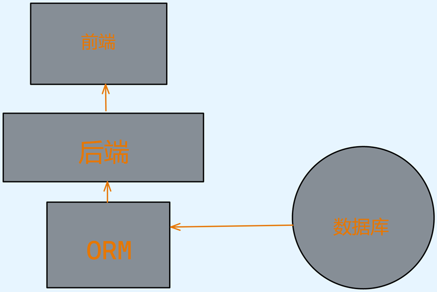
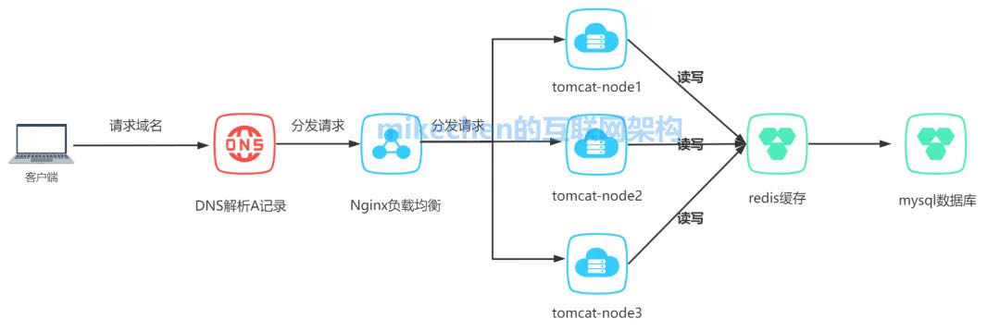
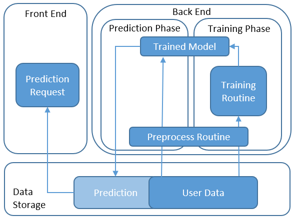
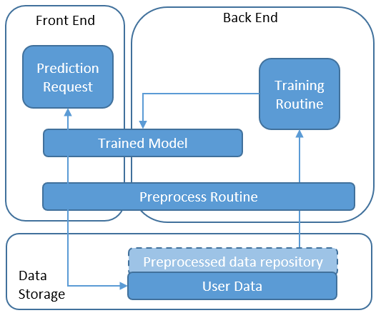
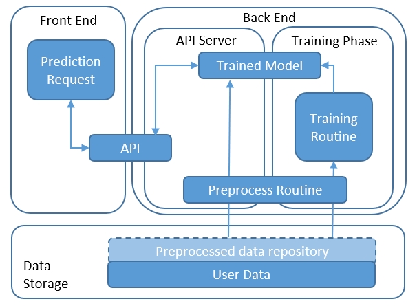
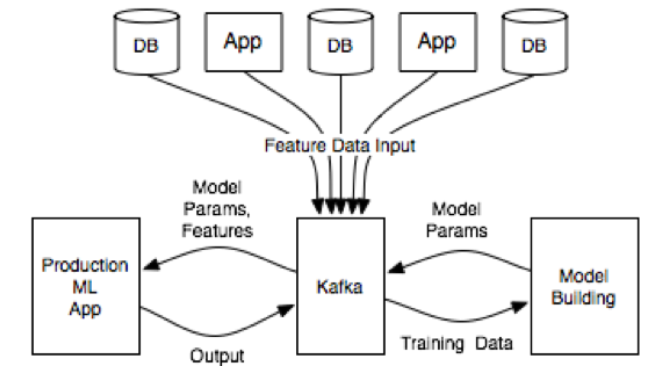

面对大量用户访问、高并发请求，海量数据，可以使用高性能的服务器、大型数据库，存储设备，高性能Web服务器，采用高效率的编程语言比如(Go,Scala)等，当单机容量达到极限时，我们需要考虑业务拆分和分布式部署，来解决大型网站访问量大，并发量高，海量数据的问题。

机器学习模型/深度学习模型/大语言模型/生产环境部署的四种系统架构总结

- 在数据库中存储预测
	- 在这种体系结构中，预测结果在预测阶段（模型预生成预测时）存储在数据存储中，并且当请求在应用程序端（前端）上发布时，将返回那些结果。

- 在模型对象上预测
	- 在这种架构中，经过训练的模型被放置在前端和后端共享的存储中。 前端收到预测请求后，它将获取预处理数据，并在模型上运行预测逻辑。 通过模型训练例程定期对模型进行重新训练并将其转储到存储中。

- 基于API预测
	- 在该架构中，预测由运行在API服务器上的API提供（例如通过Python Flask）或由无服务器功能（例如AWS Lambda或GCP Cloud Functions）托管。 API从存储中加载模型。 一旦收到请求，它将获得预处理的数据，运行预测并返回结果。 通过模型训练例程定期对模型进行重新训练并将其转储到存储中。

- 实时学习
	- 流数据（例如从物联网设备）实时传送到系统中，或当我们有特殊需要基于新到达的数据实时更新ML模型时，才需要这种体系结构。新的训练数据到达API网关并发送到预处理步骤。新数据通过消息传递功能（例如Apache Kafka）排队以将数据排队以进行下一步处理，并通过流功能（例如Spark Streaming）实时处理。接下来，处理后的数据将触发模型的重新训练，例如，使用sklearn或Spark MLlib。同时，可以响应前端请求经过预处理和预测来提供预测，就像“ 3架构”中所述。预测基于上面的API。总体架构可以使用更多受管编排服务（如Jubatas）来处理。这种架构使配置最复杂，并且需要其他架构中最有经验的架构师。

## Restful API
- RESTful API由后台也就是SERVER来提供前端来调用。前端调用API向后台发起HTTP请求，后台响应请求将处理结果反馈给前端。也就是说RESTful 是典型的基于HTTP的协议。那么RESTful API有哪些设计原则和规范呢？
1. 资源。首先是弄清楚资源的概念。资源就是网络上的一个实体，一段文本，一张图片或者一首歌曲。资源总是要通过一种载体来反应它的内容。文本可以用TXT，也可以用HTML或者XML、图片可以用JPG格式或者PNG格式，**JSON是现在最常用的资源表现形式**。
2. 统一接口。RESTful风格的数据元操CRUD（create,read,update,delete）分别对应**HTTP方法：GET用来获取资源，POST用来新建资源（也可以用于更新资源），PUT用来更新资源，DELETE用来删除资源，这样就统一了数据操作的接口。**
3. URL。**可以用一个URL（统一资源定位符）指向资源，即每个URI都对应一个特定的资源。**要获取这个资源访问它的URI就可以，因此URI就成了每一个资源的地址或识别符。一般的，每个资源至少有一个URI与之对应，最典型的URI就是URL。
4. 无状态。所谓无状态即**所有的资源都可以URL定位，而且这个定位与其他资源无关，也不会因为其他资源的变化而变化**。有状态和无状态的区别，举个例子说明一下，例如要查询员工工资的步骤为第一步：登录系统。第二步：进入查询工资的页面。第三步：搜索该员工。第四步：点击姓名查看工资。这样的操作流程就是有状态的，查询工资的每一个步骤都依赖于前一个步骤，只要前置操作不成功，后续操作就无法执行。如果输入一个URL就可以得到指定员工的工资，则这种情况就是无状态的，因为获取工资不依赖于其他资源或状态，且这种情况下，员工工资是一个资源，由一个URL与之对应可以通过HTTP中的GET方法得到资源，这就是典型的RESTful风格。

## Flask、FastAPI、Djingo开发Restful API