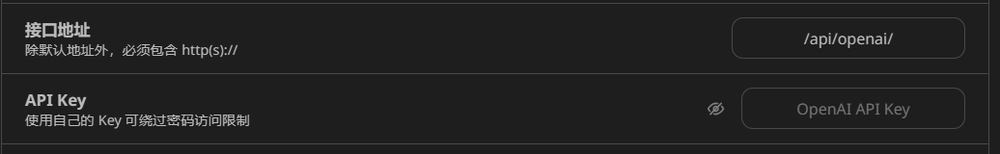
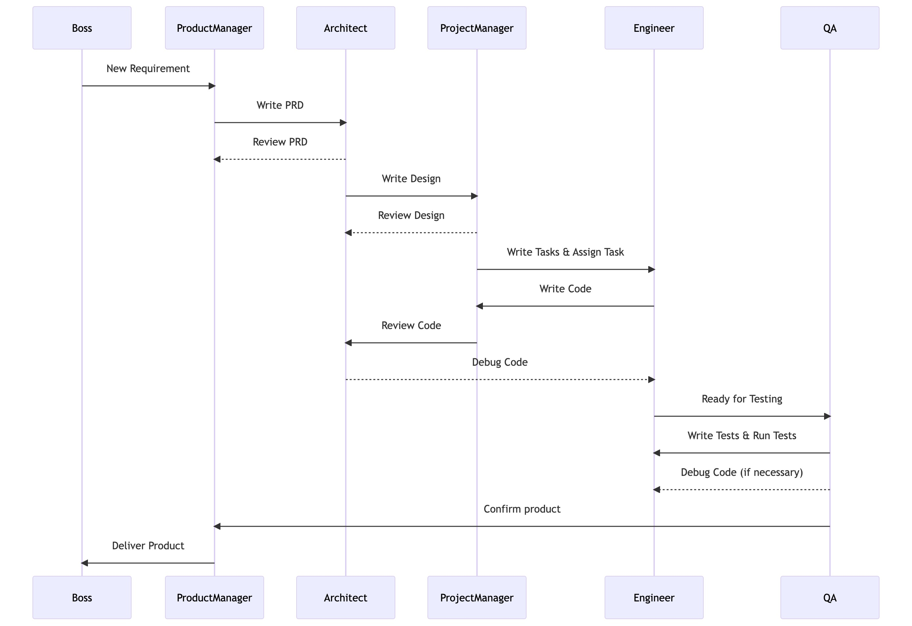

# 1、通用大模型
- OpenAI：GPT-3/4
- Google：LaMDA/PaLM
- Meta AI：LLaMA
- 百度：文心
- 阿里：千问
- 讯飞：星火
- 清华：GLM

# 2、OpenAI的账号、api_key、api_base
- 当你**注册一个应用或网站（比如OpenAI官网）**时，这个网站会提供很多服务，API（接口）就是其中的一种服务，拥有这个接口，可以在应用开发中调用这个接口，可以进行开发和部署。你想要调用这个接口，你需要去创建一个api_key（它是一个唯一的字符串，用于标识和验证API的用户），此外你还需要提供这个接口的地址api_base。
- api中转站（https://api.pro365.top/）实现API中转，生成中转api_base和中转api_key
	- 中转API的原理，则是在用户和官方服务器之间，增加一个海外的中间服务器。用户的请求发给中间服务器，再由中间服务器发给官方服务器，随后收到回复后再传回给用户。
	- api中转站后台直接对接多个官方API账户，生成多个官方的apikey
- 买一台境外的服务器，申请一个API Key，就可以部署自己的ChatGPT网站（chatgpt的镜像网站），然后申请公共域名（比如https://chatgpt.supercoolai.cn/#/chat）让别人一起使用chatgpt。
- https://chatgpt.supercoolai.cn/#/chat这就是一个chatgpt的镜像网站，只需要配置接口地址和api_key（官方的接口地址对应官方账户的apikey，中转api-key对应中转站的接口地址）就可以在这个镜像网站使用chatgpt服务。

# 3、目标
- 目标就是开发出类似MetaGPT的这个基于多智能体软件开发框架，通过这个框架能够实现软件的自动化生产。这个框架的部署方式包括：
	- 命令行界面
		- 通过 CLI 进行默认交互
	- 可视化界面
		- 通过 Gradio 提供基于 Web 的 GUI
	- API 服务器
		- 可以使用 FastAPI 包装代理并将其用作 API 端点

# 4、任务
- 大模型开发：开发出软件工厂的场景模型
- 多智能软件开发系统的开发：基于开发出的场景模型，开发出基于多智能体软件开发框架（类似MetaGPT）

# 5、大模型开发技术重点
- 

# 6、多智能体系统框架开发的技术重点
- Agent
	- 下一代 AI 技术走向并非是生成性 AI，而应该是**交互性 AI**，Agent技术是未来实现社会全面自动化的关键技术

# 7、几个相关的项目
## 7.1 agent
- https://github.com/aiwaves-cn/agents

## 7.2 AgentGPT
- https://github.com/reworkd/AgentGPT

## 7.3 open-interpreter
- https://github.com/KillianLucas/open-interpreter

## 7.4 AutoGen
- https://github.com/microsoft/autogen

## 7.5 Meta GPT
- https://github.com/geekan/MetaGPT
- 实现原理
	- 在系统中定义了几种角色，并为每种角色配备了目标和prompt模板，以此引导相关角色解决相应问题，这些角色都有自己的目标以及输入和输出，它会根据环境中观察的与自己相关的输入来处理。
		- 产品经理
			- 目标：创造一个成功的产品
			- 观察的输入：观察老板是否有新的需求
			- 可以的行动：写产品需求文档
		- 架构师
			- 目标：根据产品需求文档设计系统架构
			- 观察到输入：观察产品经理是否有新需求
			- 可以的行动：写设计文档
		- 项目经理
			- 目标：提升团队的效率
			- 观察的输入：观察是否有新的设计任务
			- 可以的行动：根据设计文档完成任务分解
		- 工程师
			- 目标：根据项目经理分解的任务完成代码和评审
			- 观察的输入：观察项目经理分解的任务
			- 可以的行动：写代码/代码评审
		- QA工程师
			- 目标：根据代码的输出和测试代码输出以及运行结果输出测试方案
			- 观察的输入：代码的运行结果
			- 可以的行动：写测试用例
	- 为每种角色定义了一个单独的“进程”运行，每个角色会**监听**有关自己的任务输入。每一个角色在运行中都是等待是否有相应的输入出现，一旦观察到相应的输入就会立马根据自己的目标，使用大模型来解决这个问题，并将结果返回到系统中。
	- 这些角色**能力和技能都是一个单独的文件**，**每一个py文件里面定义的都是对应技能的prompt模板**,每一个角色都可以通过引入这种技能来增强自己的能力，最终各个角色都是通过自己所有的这些技能来处理输入和输出，完成任务：
		- 分析代码库：analyze_dep_libs.py
		- azure的语音合成：azure_tts.py
		- debug：debug_error.py
		- 设计api：design_api.py
		- api评审：design_api_review.py
		- 设计文件名：design_filenames.py
		- 项目管理：project_management.py
		- 代码运行：run_code.py
		- 搜索和摘要：search_and_summarize.py
		- 写代码：write_code.py
		- 写代码评审：write_code_review.py
		- 写需求说明书：write_prd.py
		- 写需求说明书评审：write_prd_review.py
		- 写测试用例：write_test.py

- MetaGPT 目前已经达到一个实用状态，已经能完成小型的软件需求，网友们使用MetaGPT完成了包括贪吃蛇、打砖块游戏、2048网页版、Flappy Bird及学生管理系统等软件的开发，十分实用。

# 8、人工智能
- 机器学习：人工智能的基础
- 神经网络：人工智能的构建模块
- 数据：人工智能的燃料
- 算法：人工智能的问题解决者
- 人工智能流程：
	- 数据采集。收集供您使用的相关数据，并将其传递给培训程序以告知人工智能。
	- 数据预处理。检查数据集以删除错误数据、修复格式并确保信息保持更新。
	- 模型选择。选择最适合您需求的 AI 模型。
	- 模型训练。将您的训练数据提供给 AI 模型进行训练。
	- 模型测试。使用测试数据集确保您的模型产生准确的结果。
	- 模型优化。对模型进行更改以改进结果和性能。
	- 部署。将新的人工智能模型与当前系统集成。
	- 持续学习。不断根据新信息更新您的人工智能模型，以保持其相关性并产生良好的结果。