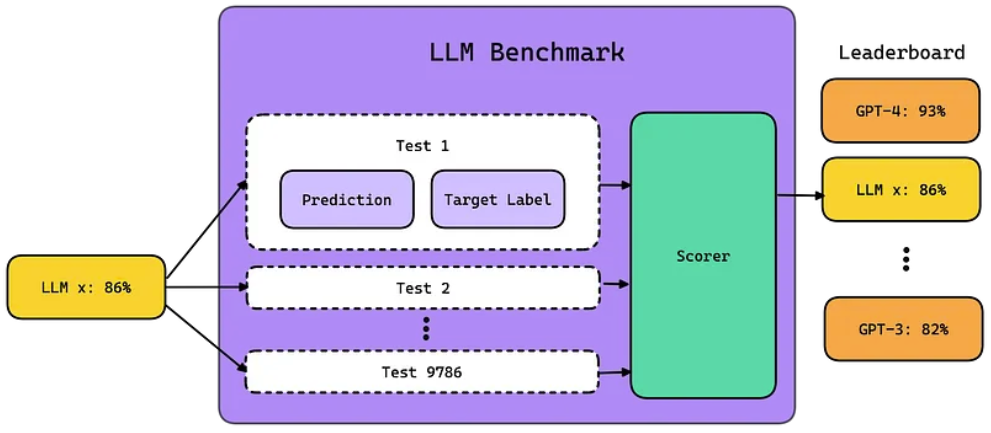

##1、自然语言处理有六个大的任务
- LLM 使用**深度神经网络（例如 transformers）**从数十亿或数万亿个单词中学习，并生成关于任何主题或领域的文本，还可以执行各种自然语言任务：

- 多对多（同步）：词性标注处理，给定语句中的词序列作为输入，给出句子中的每个词的词性
- 多对一：文本分类，输入一句话，输出其情感倾向标签（积极还是消极）（多对一每一步的输出不是必须的）
- 多对多（非同步）：机器翻译，输入一种语言的语句，输出另一种语言翻译的语句
- 一对多：输入一张图片，输出一段文字（描述图片的内容）（一对多每一步的输入不是必须的）

## 2、语言模型与大语言模型
- 语言模型（Language Model）是一种机器学习算法，它可以根据给定文本来预测下一个词语或字符的出现的**概率**。语言模型通过大量的文本数据来学习语言的**统计特征**，进而生成具有相似统计特征的新文本。其核心目标是建立一个**统计模型**，用来估计文本序列中每个词语或字符出现的概率，从而实现语言生成、语言理解等自然语言处理任务。
- 大模型主要指具有数十亿甚至上百亿参数的深度学习模型，其具备较大容量、海量参数、大算力等特点。大模型由早期的单语言预训练模型发展至多语言预训练模型，再到现阶段的多模态预训练模型，可实现处理多任务的目标。 
	- 大语言模型与普通语言模型相比，大语言模型的一个显著区别在于其规模。大语言模型通常具有**大量的参数**，并且在**训练过程中使用了巨量的文本数据**。
	- 为帮助语言模型更好地理解每个词的特征和含义， 我们需要使用大量的参数来存储和处理信息。我们会将这些**词嵌入**一个**高维的向量空间**里面，像GPT-3的向量空间的维数就有12288，这意味着GPT-3可以使用**12288个维度来充分理解某个词**。对于很多单词的理解可能比人类都要透彻。

## 3、三种大模型架构

- NLP两大任务
	- 自然语言理解
		- 自编码训练（Encoder-Only）
	- 自然语言生成
		- 自回归训练（Decoder-Only）
		- 编码器-解码器（Encoder-Decoder）

 

- Encoder-Only，仅包含编码器部分，主要适用于不需要生成序列的任务，只需要对输入进行编码和处理的单向任务场景，如文本分类、情感分析等，这类代表是BERT相关的模型，例如BERT，RoBERT，ALBERT等
- Encoder-Decoder，既包含编码器也包含解码器，通常用于序列到序列（Seq2Seq）任务，如机器翻译、对话生成等，这类代表是以Google训出来**T5**为代表相关大模型。
- **Decoder-Only**，仅包含解码器部分，通常用于序列生成任务，如文本生成、机器翻译等。这类结构的模型适用于需要生成序列的任务，可以从输入的编码中生成相应的序列。同时还有一个重要特点是可以进行无监督预训练。在预训练阶段，模型通过大量的无标注数据学习语言的统计模式和语义信息。这种方法可以使得模型具备广泛的语言知识和理解能力。在预训练之后，模型可以进行有监督微调，用于特定的下游任务（如机器翻译、文本生成等）。这类结构的代表也就是我们平时非常熟悉的**GPT**模型的结构，所有该家族的网络结构都是基于Decoder-Only的形式来逐步演化。

# 5、编码器-解码器结构

- 编码器（Encoder）：负责将输入（Input）转化为特征（Feature）
- 解码器（Decoder）：负责将特征（Feature）转化为目标（Target）

- CNN（卷积神经网络）可以认为是解码器（Decoder）可以不接受输入（Input）的情况。

- RNN（循环神经网络）可以认为是解码器（Decoder）同时接受输入（Input）的情况

## 6、基于 Transformer 的 LLM 模型架构
- 大语言模型在很大程度上代表了一类称为Transformer网络的深度学习架构。Transformer模型是一个神经网络，通过跟踪序列数据中的关系（像这句话中的词语）来学习上下文和含义。
- 最重要的是要记住，基于 Transformer 的模型的实际架构可以根据特定的研究和模型创建进行更改和增强。为了完成不同的任务和目标，GPT、BERT 和 T5 等多种模型可能会集成更多组件。

 

- 编码器的输入：是一个词，比如：机器
- 编码器的输出：词的特征表示
- 解码器的输入：初始输入（前一时刻Decoder输入+前一时刻Decoder的预测结果）+编码器的输出
- 解码器的输出：预测值：学

## 7、大模型的未来的两大趋势
- bigger and smarter
	- 主流的大模型会越做越大，越做越聪明，基座大模型出现跟移动操作系统类似的格局
		- ios（chatgpt）
		- 安卓（LLaMA）
		- 鸿蒙（国产的文心一言或其他）
- free and smaller
	- 大模型会越做越小，放到手机上，学习你手机的数据，形成你的一个AI分身

## 8、如何在业务中应用大语言模型
- 确定需求：辅助软件自动化智能化构建
- 选择合适的型号（基座模型）： OpenAI 的 GPT、Google 的 BERT以及基于 Transformer 的模型
- 访问模型：开源/闭源
- 数据预处理：消除不相关的信息、纠正错误以及将数据转换为大语言模型可以轻松理解的格式
- 微调模型：针对专门用例优化模型参数
- 实施模型：将大语言模型嵌入到反馈系统中
- 监控和更新模型：随着需求的变化，调整模型的参数

## 向量数据库（Vector Database）
- 向量数据库是一种将数据存储为高维向量的数据库，高维向量是特征或属性的数学表示。每个向量都有一定数量的维度，范围从几十到几千不等，具体取决于数据的复杂性和粒度。向量通常是通过对原始数据（例如：文本、图像、音频、视频等）应用某种变换或嵌入函数来生成的。嵌入函数可以基于各种方法，例如：机器学习模型、词嵌入、特征提取算法。

## 10、基座大模型（通用大模型）

- 闭源
	- OpenAI：**GPT-3/4**
	- Google：LaMDA/PaLM
	- 百度：文心
	- 讯飞：星火

- 开源
	- facebook Meta AI：**LLaMA2（开源）** 
	- 清华和智谱AI：**GLM3（开源）**
	- 百川智能：Baichuan（开源）
	- 阿里：千问（开源）

- 中国大模型的三大流派：
	- 百度文心一言（闭源）
	- 清华智谱GLM（开源）
	- 各种套壳（LLama是重灾区）

#### 模型的参数，以ChatGLM-6B为例
- 训练数据量：约 1T tokens（一般将一个Token视为一个单词，并为其分配一个数字，而ChatGPT不一定是一个单词一个Token，有可能单词的一部分视为一个Token，在ChatGPT中，平均大概1Token = 0.75个单词）
- 模型参数：6B（billion, 10亿）
- 词表大小：130528（中文词表）

## 11、大模型训练优化
随着深度学习技术的发展，模型的规模越来越大，参数数量也越来越多。这是因为更大的模型具有更强的表达能力，可以捕捉到更复杂的特征和模式。然而，这也带来了一些问题，如**计算资源需求增加（模型占用内存高）**、**训练时间延长**以及**过拟合风险提高**等。因此，研究人员需要在模型规模和性能之间找到一个平衡点。为了解决这个问题，研究人员提出了许多技术，如模型压缩、知识蒸馏、迁移学习等。这些技术可以在保持模型性能的同时，降低模型的参数数量和计算复杂度。此外，还有一些硬件加速器，如图形处理器（GPU）和专用集成电路（ASIC），可以加速模型的训练和推理过程。在实际应用中，选择合适的模型规模是非常重要的。如果模型太小，可能无法捕捉到数据中的关键特征，导致性能不佳。相反，如果模型太大，可能会导致过拟合问题，使得模型在未见过的数据上表现不佳。因此，研究人员需要根据具体的任务和数据集来选择合适的模型规模。

- 大模型训练优化需要解决算法、数据、算力三个方向的问题
	- 算法（Algorithm）：算法是一系列解决问题的步骤和规则。算法的设计和优化可以提高计算效率，使得相同的计算任务能够在更短的时间内完成，或者使用更少的资源。
	- 数据（Data）：数据是算法的输入和输出。数据的质量和规模对算法的性能和准确性有重要影响。好的数据能够提供更准确的结果，并帮助改进算法的训练和优化过程。
	- 算力（Computational Power）：算力指的是计算机系统的计算能力和资源。算力的提升可以支持更复杂的算法和处理更大规模的数据。高算力的计算机系统可以加速算法的执行，提高应用程序的性能和响应速度。

# 3、行业大模型
- ChatLaw（法律）
- DoctorGLM（医疗）
- FinGPT（金融）
- MediaGPT（新媒体）
- TransGPT（交通）
- TechGPT（科研）
- 软件行业
	- Copilot
	- aiXcoder
	- iFlyCode
	- **Code Llama**：代码生成大语言模型
	- CodeGeeX
	- CodeShell
	- CodeArts Snap

# 1、大语言模型提供服务的几种方式
- 命令行界面
	- 通过 命令行界面(Command Line Interface, CLI) 进行默认交互
- 可视化界面
	- 通过 Gradio 提供基于 Web 的 GUI
- API 服务器
	- 可以使用 FastAPI 包装代理并将其用作 API 端点
	

# Hugging Face
- Hugging Face：Hugging Face是一个汇聚各类开源大模型的平台，它有三大法宝：预训练的开源模型、数据集和各种工具。
	- Hugging Face就给开发者准备好了现成的开源模型、数据集和各种工具包，让开发者能够轻松地访问和使用先进的大语言模型，快速地为具体应用创建AI解决方案。就像大部分程序员都会去GitHub上找代码一样，很多AI的开发者都会去Hugging Face上找模型、调模型。

# 10、大模型挑战
挑战

1. 数据安全隐患：一方面大模型训练需要大量的数据支持，但很多数据涉及到机密以及个人隐私问题，如客户信息、交易数据等。需要保证在训练大模型的同时保障数据安全，防止数据泄露和滥用。OpenAI在发布ChatGPT模型的时候用了数月来保证数据安全以及符合人类正常价值观标准。（数据层面）
2. 成本高昂：大模型的训练和部署需要大量的计算资源和人力资源，成本非常高昂。对于一些中小型企业而言，难以承担这些成本，也难以获得足够的技术支持和资源。直接训练和部署千亿级参数大模型成本过高，**企业级应用应使用百亿级基础模型，根据不同需求训练不同的垂直模型，企业则只需要负担垂直训练成本。但是，如何实现高效的垂直训练，如何控制成本，仍是大模型面临的问题之一**。（算力层面）
3. 无法保障内容可信：大模型会编造词句，无法保障内容真实可信、有据可查。**当前使用者只能根据自己需求去验证生成的内容是否真实可信**，很难具有权威说服力。（算法层面）

解决思路：

- 以上挑战依然有很大空间值得改进，需要进一步研究和探索新的技术和方法。
- 比如可以采用数据加密、隐私保护等技术来保障数据安全；
- 可以通过改进模型架构、优化训练算法、利用分布式计算等方式来提高大模型的效率和性能；
- 此外，还可以通过开源和共享模型资源来降低成本、促进大模型的普及和应用等方式。

# 大模型基准测试
- 基准测试关乎标准化测试。它涉及使用预定义的数据集和指标来评估LLM在特定任务上的表现。
- LLM基准是一系列旨在评估LLM在诸如推理和理解等各种技能上表现的标准化测试，它们使用特定的评分器或指标来衡量这些能力。
- 不同的基准测试评估**模型能力**的各个方面，包括：
  	- 推理与常识： 这些基准测试评估LLM运用逻辑和日常知识解决问题的能力。
	- 语言理解和问答（QA）： 这些评估模型准确解读文本和回答问题的能力。
	- 编码： 此类基准测试评估LLM解析和生成代码的能力。
	- 对话与聊天机器人： 这些测试评估LLM参与对话并提供连贯、相关回应的能力。
	- 翻译： 这些评估模型准确地将文本从一种语言翻译成另一种语言的能力。
	- 数学： 这些专注于评估模型解决数学问题的能力，从基础算术到更复杂的领域如微积分。
	- 逻辑： 逻辑基准测试评估模型运用逻辑推理技巧的能力，如归纳和演绎推理。
	- 标准化测试： SAT、ACT或其他教育评估也被用来评估和基准化模型的表现。

# 大模型压缩
- 大模型量化（Quanaition）
	- 大模型量化，顾名思义，是指将大模型的参数从高精度浮点数转换为低精度整数或其他更紧凑的表示形式。这一技术旨在降低模型的计算复杂度、存储需求和能耗，从而提高模型的运行效率。
- 大模型蒸馏
	- 大模型蒸馏是一种通过知识迁移来压缩和优化模型的技术。它利用一个已经训练好的大型模型（教师模型）来指导一个小型模型（学生模型）的训练过程，从而使学生模型在保持较小计算复杂度的同时，获得与教师模型相近的性能。（比如我们可以拿着GPT4的数据，相当于拿着GPT4的回复和输入一起用来去训练我们的小模型）
- 大模型剪枝

# 批量标准化（Batch Normalization）和层标准化（Layer Normalization）的区别
- 批量标准化是对一个批次中的所有样本进行标准化处理，它是对一个批次中的所有样本的每一个特征进行归一化。
- 而层标准化是对**每个**样本的所有特征进行标准化处理，独立于同一批次中的其他样本。
- 层标准化的优点是不受批量大小的影响，可以在小批量甚至单个样本上工作。更适合序列数据。

# 自注意力（Self-Attention）和多头自注意力（Multi-Head Attention）的区别
- Self-Attention关注序列内每个位置对其他所有位置的重要性，而Multi-Head Attention则通过在多个子空间中并行计算注意力，使模型能够同时捕获和整合不同方面的上下文信息，从而增强了对复杂数据内在结构的建模能力。
- Self-Attention (自注意力机制)：自注意力机制的核心是为输入序列中的每一个位置学习一个权重分布，这样模型就能知道在处理当前位置时，哪些位置的信息更为重要。Self-Attention特指在序列内部进行的注意力计算，即序列中的每一个位置都要和其他所有位置进行注意力权重的计算。
- Multi-Head Attention (多头注意力机制)：为了让模型能够同时关注来自不同位置的信息，Transformer引入了Multi-Head Attention。它的基本思想是将输入序列的表示拆分成多个子空间（头），然后在每个子空间内独立地计算注意力权重，最后将各个子空间的结果拼接起来。这样做的好处是模型可以在不同的表示子空间中捕获到不同的上下文信息。

# 编码器中的多头自注意力（Multi-Head Attention）和解码器的掩码多头自注意力（Masked Multi-Head Attention）的区别
-  本质是因为解码器的输入（Outputs）的长度是不固定的，是逐步增加的
- 

# transformer模型的特点和优势？
- 并行计算的能力
	- 传统的RNN模型在处理序列数据时，需要按照序列的顺序逐步进行计算，这限制了其并行计算的能力。而Transformer模型则通过自注意力机制，使得模型在计算每个位置的输出时，都可以并行地考虑整个序列的信息，从而大大提高了模型的计算效率。
- 长距离依赖捕捉
	- RNN模型在处理长序列时，由于梯度消失和梯度爆炸的问题，往往难以有效地捕捉长距离依赖关系。而Transformer模型的自注意力机制在计算注意力权重时，会考虑整个输入序列的信息，因此能够很好地捕捉长距离依赖关系。这一特点使得Transformer模型在处理如机器翻译、文本摘要等需要关注长距离依赖关系的任务时，表现出色。
- 灵活性和通用性
	- Transformer模型采用了统一的架构来处理不同的NLP任务，只需通过调整输入和输出的形式，就可以适应各种任务的需求。此外，由于Transformer模型的编码器和解码器都是堆叠了多个相同的层，因此可以灵活地调整模型的深度，以适应不同的任务复杂度。这种灵活性和通用性使得Transformer模型成为了一个通用的NLP框架。
- 高效的训练和推理速度
	- Transformer模型的计算过程高度并行化，使得模型在训练和推理时都具有很高的效率。同时，由于Transformer模型采用了自注意力机制，避免了RNN的循环结构，因此在计算过程中减少了不必要的计算量，进一步提高了模型的训练和推理速度。
- 多头注意力机制
	- Transformer模型中的多头注意力机制使得模型能够同时关注输入序列的多个不同方面，从而得到更加全面和丰富的特征表示。这种机制不仅提高了模型的表示能力，还使得模型在处理复杂NLP任务时更加灵活和有效。

# 为什么现在大多数的大模型都是decoder-only？
- 问题实际上归结为 decoder-only 与 encoder-decoder 架构：有了解码器组件并由此而具有生成能力，再添加编码器组件不是更有帮助吗？
- 在选择架构时，还需要考虑其他一些因素。
	- 训练成本
	- 涌现能力
	- 从提示中进行上下文学习
	- 效率优化
	- 自回归与双向注意力
- decoder-only 架构的流行源于其简单性、良好的零样本泛化和更便宜的训练成本，从而获得合理的性能。已经有许多研究 decoder-only 和 encoder-decoder 架构性能的工作，但鉴于有足够的训练和模型大小，实际上没有确凿的证据证明一种架构在最终性能方面优于另一种架构。

# 为什么要位置编码
- 由于Transformer完全基于注意力机制，不使用循环（RNN）或卷积（CNN）结构，因此无法直接处理序列中的位置信息。为了解决这个问题，Transformer引入了位置编码，将位置信息添加到输入序列的每个元素中。这使模型能够利用元素的顺序信息。

