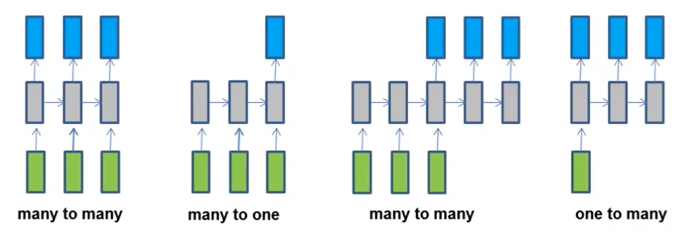
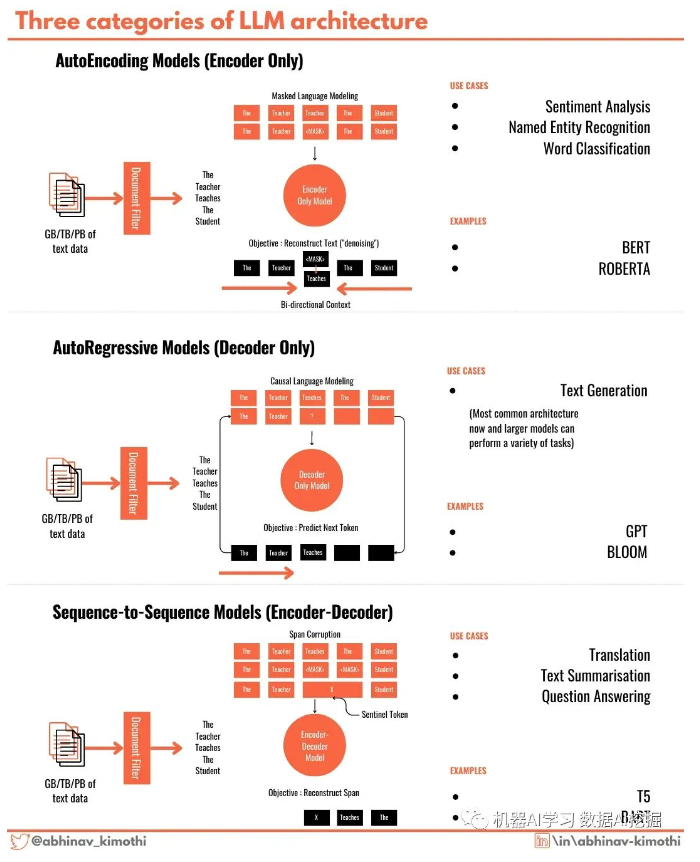
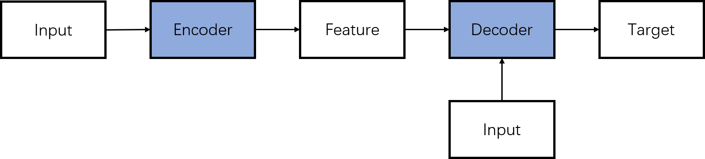
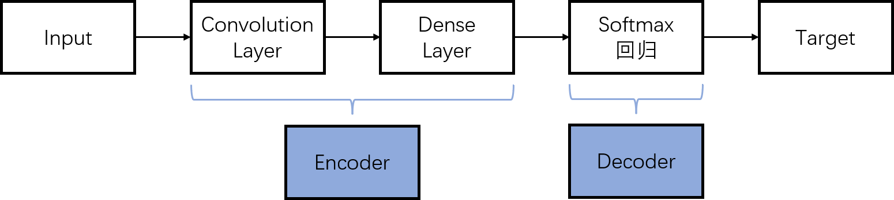
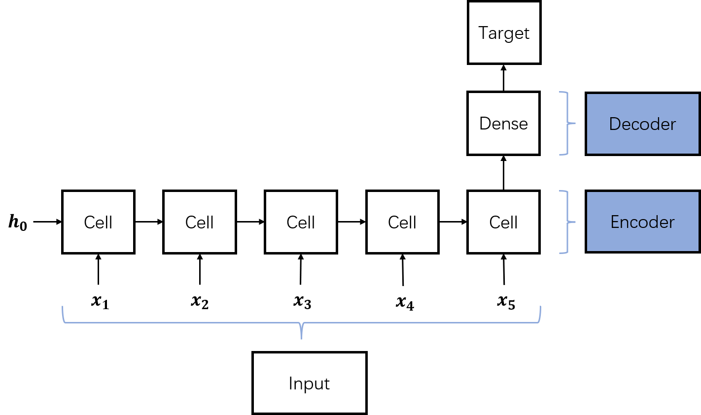
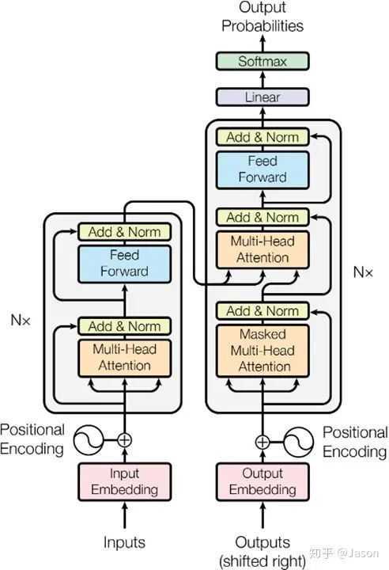
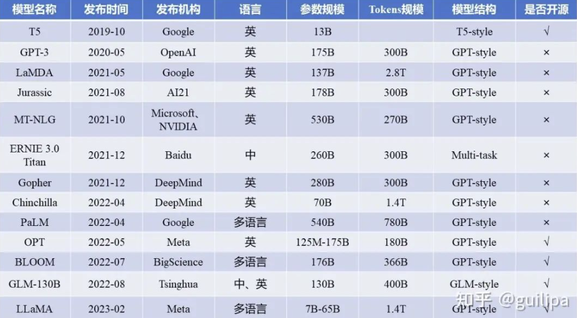

##1、自然语言处理有六个大的任务
- LLM 使用**深度神经网络（例如 transformers）**从数十亿或数万亿个单词中学习，并生成关于任何主题或领域的文本，还可以执行各种自然语言任务：
	- 分类：从文字序列到标签的映射，如文本分类。
	- 匹配：文字序列与文字序列的匹配，如搜索、阅读理解。
	- 标注和语义分析：文字序列到标签序列或结构表示的映射，如分词、词性标注、句法分析。
	- 序列生成：文字序列的生成，也就是基于语言模型的生成。
	- 序列到序列（seq2seq）：文字序列到文字序列的转化，如机器翻译、生成式对话、摘要。
	- 序贯决策：基于已有的文字序列产生新的文字序列，如多轮对话。
	- 前三个是语言理解任务，后三个是语言生成任务。

- 多对多（同步）：词性标准处理，给定语句中的词序列作为输入，给出句子中的每个词的词性
- 多对一：输入一句话，输出其情感倾向标签（积极还是消极）
- 多对多（非同步）：机器翻译，输入一种语言的语句，输出另一种语言翻译的语句
- 一对多：输入一张图片，输出一段文字（描述图片的内容）

- 多对一每一步的输出不是必须的
- 一对多每一步的输入不是必须的

## 2、语言模型与大语言模型
- 语言模型（Language Model）是一种机器学习算法，它可以根据给定文本来预测下一个词语或字符的出现的**概率**。语言模型通过大量的文本数据来学习语言的**统计特征**，进而生成具有相似统计特征的新文本。其核心目标是建立一个**统计模型**，用来估计文本序列中每个词语或字符出现的概率，从而实现语言生成、语言理解等自然语言处理任务。
- 大模型主要指具有数十亿甚至上百亿参数的深度学习模型，其具备较大容量、海量参数、大算力等特点。大模型由早期的单语言预训练模型发展至多语言预训练模型，再到现阶段的多模态预训练模型，可实现处理多任务的目标。 
	- 大语言模型与普通语言模型相比，大语言模型的一个显著区别在于其规模。大语言模型通常具有**大量的参数**，并且在**训练过程中使用了巨量的文本数据**。
	- 为帮助语言模型更好地理解每个词的特征和含义， 我们需要使用大量的参数来存储和处理信息。我们会将这些**词嵌入**一个**高维的向量空间**里面，像GPT-3的向量空间的维数就有12288，这意味着GPT-3可以使用**12288个维度来充分理解某个词**。对于很多单词的理解可能比人类都要透彻。

## 3、三种大模型架构
 

- Encoder-Only，仅包含编码器部分，主要适用于不需要生成序列的任务，只需要对输入进行编码和处理的单向任务场景，如文本分类、情感分析等，这类代表是BERT相关的模型，例如BERT，RoBERT，ALBERT等
- Encoder-Decoder，既包含编码器也包含解码器，通常用于序列到序列（Seq2Seq）任务，如机器翻译、对话生成等，这类代表是以Google训出来**T5**为代表相关大模型。
- **Decoder-Only**，仅包含解码器部分，通常用于序列生成任务，如文本生成、机器翻译等。这类结构的模型适用于需要生成序列的任务，可以从输入的编码中生成相应的序列。同时还有一个重要特点是可以进行无监督预训练。在预训练阶段，模型通过大量的无标注数据学习语言的统计模式和语义信息。这种方法可以使得模型具备广泛的语言知识和理解能力。在预训练之后，模型可以进行有监督微调，用于特定的下游任务（如机器翻译、文本生成等）。这类结构的代表也就是我们平时非常熟悉的**GPT**模型的结构，所有该家族的网络结构都是基于Decoder-Only的形式来逐步演化。

## 4、大语言模型的开发技术
- 预训练：预训练是在针对特定任务进行微调之前，在大型数据集（通常是无监督或自监督）上训练 LLM 的过程。在预训练期间，模型学习一般语言模式、单词之间的关系以及其他基础知识。此过程产生预训练模型，可以使用较小的特定于任务的数据集进行微调，从而显着减少在各种 NLP 任务上实现高性能所需的标记数据量和训练时间。
	- 数据收集：在预训练阶段，会收集来自互联网的大规模文本语料库。通常，这个语料库包含来自各种来源的多样化文本。
	- 分词：收集的文本数据被分割成称为标记的较小单元，可以是单词或子词单位。
	- 模型架构：为预训练选择了一个神经网络架构，通常基于变压器模型。
	- 训练目标：模型被训练以预测基于前面标记的概率分布中的下一个标记。这被称为语言建模目标。
	- 大规模训练：预训练需要大量计算资源，通常在强大的硬件上进行，使用大批量大小和多个GPU或TPU。
	- 检查点：在训练过程中定期保存模型参数的快照（检查点）。
- 迁移学习（微调）：迁移学习是一种利用预训练期间获得的知识并将其应用于新的相关任务的技术。在LLM的背景下，迁移学习涉及在较小的特定任务数据集上微调预训练模型，以实现该任务的高性能。迁移学习的好处在于，它允许模型从预训练期间学到的大量通用语言知识中受益，从而减少对大型标记数据集和每个新任务的大量训练的需求。
	- 任务特定数据集：对于微调，需要准备一个与特定自然语言处理（NLP）任务相关的数据集。这个数据集包含了用于监督任务的标记示例，或者对于强化学习任务来说是奖励信号。
	- 迁移学习：加载预训练的基础模型，该模型已经学会了一般的语言理解。微调涉及根据任务特定数据集来更新模型的参数。
	- 微调策略：使用各种技术，如梯度下降，来更新模型的参数，同时最小化任务特定的损失函数。
	- 超参数调整：微调可能涉及调整超参数，如学习率、批量大小和丢弃率，以优化任务性能。
	- 评估：在验证集上评估微调后的模型性能，并根据需要进行调整。
	- 部署：一旦微调后的模型在验证集上表现良好，就可以将其部署到特定任务的实际应用中。

# 5、编码器-解码器结构

- 编码器（Encoder）：负责将输入（Input）转化为特征（Feature）
- 解码器（Decoder）：负责将特征（Feature）转化为目标（Target）

- CNN（卷积神经网络）可以认为是解码器（Decoder）可以不接受输入（Input）的情况。

- RNN（循环神经网络）可以认为是解码器（Decoder）同时接受输入（Input）的情况

## 6、基于 Transformer 的 LLM 模型架构
大语言模型在很大程度上代表了一类称为Transformer网络的深度学习架构。Transformer模型是一个神经网络，通过跟踪序列数据中的关系（像这句话中的词语）来学习上下文和含义。

- 输入模块
	- 标记化（Tokenization）：标记化是将文本序列转换为模型可以理解的**单个单词、子词或标记**的过程。在LLM中，标记化通常使用字节对编码 (BPE) 或 WordPiece 等子字算法来执行，这些算法将文本分割成更小的单元，以捕获频繁和罕见的单词。这种方法有助于限制模型的词汇量大小，同时保持其表示任何文本序列的能力。
	- 词嵌入（Embbeding）：输入文本被**标记**为更小的单元，例如单词或子词，并且每个标记被**嵌入**到连续向量表示中。此嵌入步骤捕获输入的语义和句法信息。嵌入是单词或标记的连续向量表示，可捕获它们在高维空间中的语义。它们允许模型将离散标记转换为神经网络可以处理的格式。在LLM中，嵌入是在训练过程中学习的，所得的向量表示可以捕获单词之间的复杂关系，例如同义词或类比。
	- 位置编码：位置编码被添加到输入嵌入中以提供有关标记位置的信息，因为转换器不会自然地对标记的顺序进行编码。这使得模型能够处理标记，同时考虑它们的顺序。

- 编码器模块（给定文本的输入提取文本的特征，将输入序列转化为上下文感知的表示）：基于神经网络技术，编码器分析输入文本并创建许多隐藏状态来保护文本数据的上下文和含义。多个编码器层构成了 Transformer 架构的核心。
	- 自注意力机制：自注意力使模型能够通过计算**注意力分数**来权衡输入序列中不同标记的重要性。它允许模型以上下文感知的方式考虑不同标记之间的依赖关系和关系。LLM 中的注意力机制，特别是 Transformer 中使用的自注意力机制，允许模型权衡给定上下文中不同单词或短语的重要性。通过为输入序列中的标记分配不同的权重，模型可以专注于最相关的信息，同时忽略不太重要的细节。这种有选择地关注输入的特定部分的能力对于捕获远程依赖性和理解自然语言的细微差别至关重要。
		- 多头注意力：Transformers 通常采用多头注意力，其中自注意力与不同的学习注意力权重同时执行。这使得模型能够捕获不同类型的关系并同时处理输入序列的各个部分。可以捕获单词之间多种维度上的相关系数 attention score。
	- 残差连接：用于解决多层网络训练的问题，可以让网络只关注当前差异的部分
	- 前馈神经网络：在自注意力步骤之后，前馈神经网络独立地应用于每个标记。该网络包括具有非线性激活函数的完全连接层，使模型能够捕获令牌之间的复杂交互。
	- 规范化层：

- 解码器模块（根据编码器的输出和目标序列生成一个新的序列）
	- 解码器层：在一些基于变压器的模型中，除了编码器之外还包含解码器组件。解码器层支持自回归生成，其中模型可以通过关注先前生成的标记来生成顺序输出。

- 输出模块
	- 层归一化：层归一化应用于变压器架构中的每个子组件或层之后。它有助于稳定学习过程并提高模型泛化不同输入的能力。
	- 输出层：变压器模型的输出层可以根据具体任务而变化。例如，在语言建模中，通常使用线性投影和 SoftMax 激活来生成下一个标记的概率分布。
- 最重要的是要记住，基于 Transformer 的模型的实际架构可以根据特定的研究和模型创建进行更改和增强。为了完成不同的任务和目标，GPT、BERT 和 T5 等多种模型可能会集成更多组件。

 

- 编码器的输入：是一个词，比如：机器
- 编码器的输出：词的特征表示
- 解码器的输入：初始输入（前一时刻Decoder输入+前一时刻Decoder的预测结果）+编码器的输出
- 解码器的输出：预测值：学

## 7、大模型的未来的两大趋势
- bigger and smarter
	- 主流的大模型会越做越大，越做越聪明，基座大模型出现跟移动操作系统类似的格局
		- ios（chatgpt）
		- 安卓（LLaMA）
		- 鸿蒙（国产的文心一言或其他）
- free and smaller
	- 大模型会越做越小，放到手机上，学习你手机的数据，形成你的一个AI分身

## 8、如何在业务中应用大语言模型
- 确定需求：辅助软件自动化智能化构建
- 选择合适的型号（基座模型）： OpenAI 的 GPT、Google 的 BERT以及基于 Transformer 的模型
- 访问模型：开源/闭源
- 数据预处理：消除不相关的信息、纠正错误以及将数据转换为大语言模型可以轻松理解的格式
- 微调模型：针对专门用例优化模型参数
- 实施模型：将大语言模型嵌入到反馈系统中
- 监控和更新模型：随着需求的变化，调整模型的参数

## 向量数据库（Vector Database）
	- 向量数据库是一种将数据存储为高维向量的数据库，高维向量是特征或属性的数学表示。每个向量都有一定数量的维度，范围从几十到几千不等，具体取决于数据的复杂性和粒度。向量通常是通过对原始数据（例如：文本、图像、音频、视频等）应用某种变换或嵌入函数来生成的。嵌入函数可以基于各种方法，例如：机器学习模型、词嵌入、特征提取算法。

## 10、基座大模型

## 11、大模型训练优化
- 大模型训练优化需要解决算法、数据、算力三个方向的问题
	- 算法（Algorithm）：算法是一系列解决问题的步骤和规则。算法的设计和优化可以提高计算效率，使得相同的计算任务能够在更短的时间内完成，或者使用更少的资源。
	- 数据（Data）：数据是算法的输入和输出。数据的质量和规模对算法的性能和准确性有重要影响。好的数据能够提供更准确的结果，并帮助改进算法的训练和优化过程。
	- 算力（Computational Power）：算力指的是计算机系统的计算能力和资源。算力的提升可以支持更复杂的算法和处理更大规模的数据。高算力的计算机系统可以加速算法的执行，提高应用程序的性能和响应速度。

# 1、大语言模型部署方式
- 命令行界面
	- 通过 命令行界面(Command Line Interface, CLI) 进行默认交互
- 可视化界面
	- 通过 Gradio 提供基于 Web 的 GUI
- API 服务器
	- 可以使用 FastAPI 包装代理并将其用作 API 端点
	
# 2、通用大模型
- 闭源
	- OpenAI：**GPT-3/4**
	- Google：LaMDA/PaLM
	- 百度：文心
	- 讯飞：星火

- 开源
	- Meta AI：**LLaMA2（开源）** 
	- 清华和智谱AI：**GLM3（开源）**
	- 百川智能：Baichuan（开源）
	- 阿里：千问（开源）

# Hugging Face
- Hugging Face：Hugging Face是一个汇聚各类开源大模型的平台，它有三大法宝：预训练的开源模型、数据集和各种工具。
	- Hugging Face就给开发者准备好了现成的开源模型、数据集和各种工具包，让开发者能够轻松地访问和使用先进的大语言模型，快速地为具体应用创建AI解决方案。就像大部分程序员都会去GitHub上找代码一样，很多AI的开发者都会去Hugging Face上找模型、调模型。
#### 模型的参数，以ChatGLM-6B为例
- 训练数据量：约 1T tokens（一般将一个Token视为一个单词，并为其分配一个数字，而ChatGPT不一定是一个单词一个Token，有可能单词的一部分视为一个Token，在ChatGPT中，平均大概1Token = 0.75个单词）
- 模型参数：6B（billion）
- 词表大小：130528（中文词表）

# 3、行业大模型
- ChatLaw（法律）
- DoctorGLM（医疗）
- FinGPT（金融）
- MediaGPT（新媒体）
- TransGPT（交通）
- TechGPT（科研）
- 软件行业
	- Copilot
	- aiXcoder
	- iFlyCode
	- **Code Llama**：代码生成大语言模型
	- CodeGeeX
	- CodeShell
	- CodeArts Snap

# 10、大模型挑战
挑战

1. 数据安全隐患：一方面大模型训练需要大量的数据支持，但很多数据涉及到机密以及个人隐私问题，如客户信息、交易数据等。需要保证在训练大模型的同时保障数据安全，防止数据泄露和滥用。OpenAI在发布ChatGPT模型的时候用了数月来保证数据安全以及符合人类正常价值观标准。（数据层面）
2. 成本高昂：大模型的训练和部署需要大量的计算资源和人力资源，成本非常高昂。对于一些中小型企业而言，难以承担这些成本，也难以获得足够的技术支持和资源。直接训练和部署千亿级参数大模型成本过高，**企业级应用应使用百亿级基础模型，根据不同需求训练不同的垂直模型，企业则只需要负担垂直训练成本。但是，如何实现高效的垂直训练，如何控制成本，仍是大模型面临的问题之一**。（算力层面）
3. 无法保障内容可信：大模型会编造词句，无法保障内容真实可信、有据可查。**当前使用者只能根据自己需求去验证生成的内容是否真实可信**，很难具有权威说服力。（算法层面）

解决思路：

- 以上挑战依然有很大空间值得改进，需要进一步研究和探索新的技术和方法。
- 比如可以采用数据加密、隐私保护等技术来保障数据安全；
- 可以通过改进模型架构、优化训练算法、利用分布式计算等方式来提高大模型的效率和性能；
- 此外，还可以通过开源和共享模型资源来降低成本、促进大模型的普及和应用等方式。

# 模型压缩技术
目前深度学习在各个领域轻松碾压传统算法，不过真正用到实际项目中却会有很大的问题：

- 计算量非常巨大
- 模型占用很高内存

# 批量标准化（Batch Normalization）和层标准化（Layer Normalization）的区别
- 批量标准化是对一个批次中的所有样本进行标准化处理，它是对一个批次中的所有样本的每一个特征进行归一化。
- 而层标准化是对每个样本的所有特征进行标准化处理，独立于同一批次中的其他样本。
- 层标准化的优点是不受批量大小的影响，可以在小批量甚至单个样本上工作。更适合序列数据。

# 自注意力（Self-Attention）和多头注意力（Multi-Head Attention）的区别