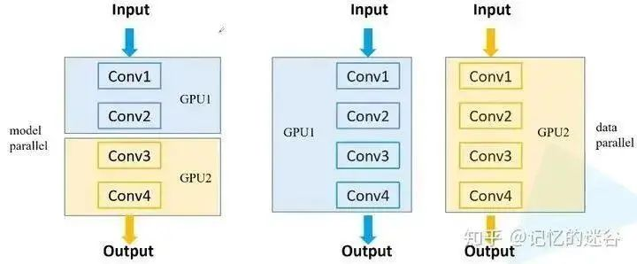

# 实战
- 环境
	- 硬件环境
		- CPU:i7-9700F
		- 显卡：GPU:2070S 8G
			- 单卡
			- 多卡
		- 内存:DDR4 32G

	- 软件环境
		- Windows
		- Ubuntu
		- Centos
		- Mac

- 如何从零训练一个大语言模型？
	- 案例：	手把手开发一个大预言模型
- 如何部署一个已经训练好的大模型？
	- 案例：搭建环境实现本地部署ChatGLM2 6B 大模型
- 如何基于chatGLM-6B模型预训练，添加自己的数据集微调？
	- 案例：基于chatGLM-6B模型预训练，添加自己的数据集微调
- 如何开发一个大模型应用？
	- 案例：	基于大模型构建个人知识库助手
- 如何开发一个简单的智能体系统？
	- 案例：Meta GPT

# 4、大模型开发
- 数据
	- 数据源（代码库、文档）
		- 典型的训练数据集由来自多种来源的**文本数据**组成，例如**爬取的公共数据、在线出版物或书籍库、来自GitHub的代码数据、维基百科、新闻、社交媒体对话等**。例如，考虑**The Pile**。The Pile是由EleutherAI创建的用于大规模语言建模的流行文本语料库。它包含来自22个数据源的数据，粗略地分为五个大类：
			- 学术写作：PubMed摘要和PubMed Central，arXiv，FreeLaw，USPTO背景，PhilPapers，NIH Exporter
			- 在线或抓取的资源：CommonCrawl，OpenWebText2，Stack Exchange，Wikipedia
			- 散文：BookCorpus2，Bibliotik，Project Gutenberg
			- 对话：YouTube字幕，Ubuntu IRC，OpenSubtitles，Hacker News，Europarl
			- 杂项：GitHub，DeepMind数学数据集，Enron电子邮件
		- The Pile数据集是为公众免费提供的极少数大规模文本数据集之一。对于大多数现有的模型，如GPT-3、PaLM和Galactica，它们的训练和评估数据集并不公开。考虑到编译和预处理这些数据集以进行LLM训练所需的大规模努力，大多数公司都将它们保留在内部以保持竞争优势。这使得像The Pile和AllenAI的少量数据集对于公共大规模NLP研究目的非常有价值。
		- 在数据集收集期间，一般数据可以由非专家收集，但特定领域的数据通常需要由专业主题专家（SMEs）收集或咨询，例如医生、物理学家、律师等。
	- 数据预处理
		- 数据过滤与采样
		- 数据清洗
		- 数据去重（定义词汇表）
		- Tokenization（分词编码）
		- Embbeding（分词嵌入）
- 算法
	- 模型架构：
		- 自编码器（Autoencoders）
		- 自回归模型（Autoregressors）
		- 序列到序列模型（Sequence-to-Sequence）
	- 超参数设置：
		- 如学习率
		- 批量大小
		- 迭代次数
	- 微调
		- RAG
		- RLHF
	- 分布式训练框架
		- 如何选择
			- 训练成本：不同的训练工具，训练同样的大模型，成本是不一样的。对于大模型，训练一次动辄上百万/千万美元的费用。合适的成本始终是正确的选择。
			- 训练类型：是否支持数据并行、张量并行、流水线并行、多维混合并行、自动并行等
			- 效率：将普通模型训练代码变为分布式训练所需编写代码的行数，我们希望越少越好。
			- 灵活性：你选择的框架是否可以跨不同平台使用？
		- 常见的训练框架：
			- 第一类：深度学习框架自带的分布式训练功能。如：TensorFlow、PyTorch、MindSpore、Oneflow、PaddlePaddle等。
			- 第二类：基于现有的深度学习框架（如：PyTorch、Flax）进行扩展和优化，从而进行分布式训练。如：Megatron-LM（张量并行）、DeepSpeed（Zero-DP）、Colossal-AI（高维模型并行，如2D、2.5D、3D）、Alpa（自动并行）等
		- 两条实施路线：
			- TPU + XLA + TensorFlow/JAX ：由Google主导，由于TPU和自家云平台GCP深度绑定
			- GPU + PyTorch + Megatron-LM + DeepSpeed ：由NVIDIA、Meta、MicroSoft大厂加持，社区氛围活跃，也更受到大家欢迎。
- 算力
	- GPU（多卡）
	- 集群（多机）
	- 并行化（多机和多卡并行）
		- 数据并行（如：PyTorch DDP）
		- 模型/张量并行（如：Megatron-LM（1D）、Colossal-AI（2D、2.5D、3D））
		- 流水线并行（如：GPipe、PipeDream、PipeDream-2BW、PipeDream Flush（1F1B））
		- 多维混合并行（如：3D并行（数据并行、模型并行、流水线并行））
		- 自动并行（如：Alpa（自动算子内/算子间并行））
		- 优化器相关的并行（如：ZeRO（零冗余优化器，在执行的逻辑上是数据并行，但可以达到模型并行的显存优化效果）、PyTorch FSDP）
- 对于以Transformer、MOE结构为代表的大模型来说，传统的单机单卡训练模式肯定不能满足上千（万）亿级参数的模型训练，这时候我们就需要解决**内存墙和通信墙**等一系列问题，在**单机多卡或者多机多卡**进行模型训练。
- 多卡（GPU）并行
 	- 模型并行：如果模型特别大，GPU显存不够，无法将一个显存放在GPU上，需要把网络的不同模块放在不同GPU上，这样可以训练比较大的网络。
	- 数据并行：将整个模型放在一块GPU里，再复制到每一块GPU上，同时进行正向传播和反向误差传播。相当于加大了batch_size。

	- 