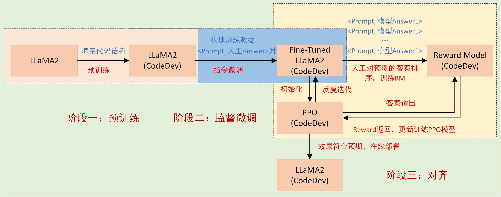

# 实战
- 环境
	- 硬件环境
		- CPU:i7-9700F
		- 显卡：GPU:2070S 8G
			- 单卡
			- 多卡
		- 内存:DDR4 32G

	- 软件环境
		- Windows
		- Ubuntu
		- Centos
		- Mac

- 如何从零训练一个大语言模型？
	- 案例：	手把手开发一个大预言模型
- 如何部署一个已经训练好的大模型？
	- 案例：搭建环境实现本地部署ChatGLM2 6B 大模型
- 如何基于chatGLM-6B模型预训练，添加自己的数据集微调？
	- 案例：基于chatGLM-6B模型预训练，添加自己的数据集微调
- 如何开发一个大模型应用？
	- 案例：	基于大模型构建个人知识库助手
- 如何开发一个简单的智能体系统？
	- 案例：Meta GPT

# 1、大模型开发--------从训练数据和训练方法的角度
- 假设我们选择LLaMA2为基座模型，想经过预训练、微调、优化得到领域适配模型CodeDev

- 整体上可以分为三个阶段，分别如下：
	- 预训练（Pre-Training,PT）：基于LLaMA2的初始模型，经过海量代码语料训练，得到领域适配的LLaMA2
	- 监督微调(Supervised Finetuning, SFT)--------指令微调：构建训练数据（指令微调数据集）完成指令微调
	- 对齐微调（Alignment Tuning）----------基于人类反馈的强化学习（RLHF）：模型通过与环境互动和接收反馈来学习。对模型的训练是为了最大化奖励信号（使用 PPO），奖励信号通常来自人类对模型输出的评估。
- 第一阶段：预训练（Pre-Training,PT）
	- 预训练是LLM训练的第一阶段，它在**大规模未标记的文本数据集上进行**。这个阶段的主要目标是使模型吸收大量的知识和语言结构。预训练阶段采用了**自监督学习方法**，其中模型预测给定上下文下一个词或令牌是什么。
		- 数据集选择：通常使用包含数十亿到数万亿令牌的庞大文本语料库，如互联网文本。
		- 自监督学习：模型根据文本数据的上下文预测下一个词，这种任务称为下一个词预测。通过这个任务，模型学习了语法、语义和常识知识。
- 第二阶段：监督微调(Supervised Finetuning, SFT)
	- 监督微调是LLM训练的第二阶段，其目的是根据特定任务进行指令微调，使其更适合执行具体的自然语言处理任务。与预训练不同，监督微调需要**特定的标记数据集**，其中包含了指令和相应的期望输出。
		- 数据集**准备**：人类编写指令-输出对，指令是模型的输入，期望输出是我们期望模型生成的内容。这通常需要耗费大量人力和时间。
- 第三阶段：对齐微调（Alignment Tuning）：基于人类反馈的强化学习（RLHF）
	- 对齐是LMM训练的第三阶段，目标是将LLM的输出与人类偏好对齐，以进一步提高模型的性能、帮助性和安全性。这一阶段常常涉及强化学习与人类反馈（RLHF）的应用。RLHF是对齐阶段的核心，它为模型提供了一个持续学习和改进的机制。在RLHF中，模型生成回答（response或answer），并接收人类提供的反馈信息。RLHF由两部分组成：
		- 训练奖励模型RM（Reward Model）
			- 对SFT训练得到的模型喂入一些prompt，使它输出多个response，由人类进行打分排序，所得到的包含**(prompt, response)排序**的数据集进行训练得到RM模型
		- 使用奖励模型（评分函数）进行微调
			- 将SFT训练的LMM模型作为策略（Policy），将RM模型视为环境（Environment），采用PPO的RL方法训练LMM模型，得到最终模型。

# 4、大模型微调------从参数规模的角度
- 本质上，现在的大模型要解决的问题，就是一个序列数据转换的问题：
	- 输入序列 X = [x1, x2, ..., xm]， 输出序列Y = [y1, y2, …, yn]，X和Y之间的关系是：Y = WX。
- 从微调的参数规模的角度，大模型的微调分成两条技术路线：
	- 一条是对全量的参数，进行全量的训练，这条路径叫全量微调FFT(Full Fine Tuning)。
		- FFT的原理，就是用特定的数据，对大模型进行训练，将`W`变成`W‘`，`W``相比`W`，最大的优点就是上述特定数据领域的表现会好很多。
	- 一条是只对部分的参数进行训练，这条路径叫参数高效微调PEFT(Parameter-Efficient Fine Tuning)。
		- Prompt Tuning（提示微调）
			- Prompt Tuning是在Embedding环节，往输入序列X前面加特定的Token。
			- 就是将X = [x1, x2, ..., xm]变成，X' = [x'1, x'2, ..., x'k; x1, x2, ..., xm], Y = WX'。
		- Prefix Tuning（前缀微调）
			- Prefix Tuning是在Transformer的Encoder和Decoder的网络中都加了一些特定的前缀。
			- 就是将Y=WX中的W，变成W'= [Wp; W]，Y=W'X。
		- LoRA（低秩适配）
			- 大模型参数很多，但并不是所有的参数都是发挥同样作用的
		- QLoRA
			- QLoRA就是量化版的LoRA，它是在LoRA的基础上，进行了进一步的量化，将原本用16bit表示的参数，降为用4bit来表示，可以在保证模型效果的同时，极大地降低成本。

# 2、大模型开发-------方法思路（代码大模型分类）

- Row LM（基座模型）：这些模型虽然是基座模型（预训练模型），但是已经具备代码大模型的能力。
	- LaMDA
	- PaLM
	- GPT-NeoX
	- BLOOM
	- LLaMA
	- GPT-4
	- LLaMA 2
	- Phi-1.5
	- Baichuan 2
	- Qwen
- Adapted LM：这些模型是在基座模型的基础上，加入代码相关的语料进一步进行预训练得到的代码大模型。
	- Codex (GPT-3)
	- PaLM Coder (PaLM)
	- Minerva (PaLM)
	- PaLM 2 * (PaLM 2)
	- **Code LLaMA** (LLaMA 2)
- Specialized LM：这些模型从零开始（没有在基座模型的基础上）预训练，得到一个代码大模型
	- Encoder
		- CuBERT (MLM + NSP)
		- CodeBERT (MLM + RTD)
		- GraphCodeBERT (MLM + DFG Edge Prediction + DFG Node Alignment)
		- SynCoBERT (MLM + Identifier Prediction + AST Edge Prediction + Contrastive Learning)
		- DISCO (MLM + Node Type MLM + Contrastive Learning)
		- Code-MVP (MLM + Type Inference + Contrastive Learning)
	- Decoder
		- GPT-C (CLM)
		- CodeGPT (CLM)
		- CodeParrot (CLM)
		- PolyCoder (CLM)
		- CodeGen (CLM)
		- InCoder (Causal Masking)
		- PyCodeGPT (CLM)
		- PanGu-Coder (CLM)
		- SantaCoder (FIM)
		- CodeGeeX (CLM)
		- StarCoder (FIM)
		- Phi-1 (CLM)
		- CodeFuse (CLM)
		- CodeShell (CLM)
		- DeepSeek Coder (CLM)
	- Encoder-Decoder
		- PyMT5 (Span Corruption)
		- Mastropaolo et al. (MLM + Deobfuscation)
		- DOBF (Span Corruption)
		- PLBART (DAE)
		- CodeT5 (Span Corruption + Identifier Tagging + Masked Identifier Prediction + Text2Code + Code2Text)
		- SPT-Code (Span Corruption + NSP + Method Name Prediction)
		- AlphaCode (MLM + CLM)
		- NatGen (Code Naturalization)
		- CodeT5+ (Span Corruption + CLM + Text-Code Contrastive Learning + Text-Code Translation)
	- UniLM
		- CugLM (MLM + NSP + CLM)
		- UniXcoder (MLM + NSP + CLM + Span Corruption + Contrastive Learning + Code2Text)
- Code Finetuning LM：这些模型是在Row LM/Adapted LM/Specialized LM的基础上做进一步的微调，得到的代码大模型
	- 进行指令微调的模型
		- WizardCoder (StarCoder + Evol-Instruct)
		- PanGu-Coder 2 (StarCoder + Evol-Instruct + RRTF)
		- OctoCoder (StarCoder) / OctoGeeX (CodeGeeX2)
		- **MFTCoder** (Code LLaMA)
	- 进行增强学习的模型
		- CompCoder
		- CodeRL
		- PPOCoder
		- RLTF

# 3、大模型开发-----数据源与数据格式
- 预训练数据
	- 预训练数据的来源可以大致分为两类：
		- 通用文本数据General Text Data
			- 网页Webpages
				- 为了方便使用这些数据资源，在以前的工作中，大量的数据被从网上抓取，如CommonCrawl。
			- 对话文本Conversation text
				- 研究人员可以利用公共会话语料库的子集（如PushShift.io Reddit语料库）或从在线社交媒体收集会话数据。
			- 书籍Books
				- 为了获得开源的书籍数据，现有的研究通常采用Books3和Bookcorpus2数据集，这些数据集可以在Pile数据集中找到。
		- 专门的文本数据Specialized Text Data
			- 多语言文本Multilingual text
				- BLOOM和PaLM在其预训练语料库中分别策划了涵盖46种和122种语言的多语言数据
			- 科学文本Scientific text
				- 收集arXiv论文、科学教科书、数学网页和其他相关科学资源。
				- 由于科学领域数据的复杂性，如数学符号和蛋白质序列，通常需要特定的标记化和预处理技术来将这些不同格式的数据转化为可由语言模型处理的统一形式。
			- **代码Code**
				- 第一种来源是来自编程问题回答社区，如Stack Exchange。
				- 第二个来源是公共软件库，如GitHub，在那里收集代码数据（包括评论和文档字符串）以供利用。
- 指令微调数据
	- 指令微调的关键在于微调数据集的构建。**指令数据集中的每个实例一般由三个元素组成**:
		- instruction: 指令，它是指定任务的自然语言文本序列，是对模型的语言提示
		- input: 输入（可以为空）：上下文提供补充信息的可选输入
		- output: 基于指令和输入的预期输出
		- 数据格式：整体的结构采用{instruction，input，output}，数据集可以以文本文件（如CSV、JSON等）或数据库的形式存储。每个实例包含输入提示和预期的输出。
	- 构造指令数据集有两种方法：
		- 人工构建（数据集成）
			- 从现有的带注释的自然语言数据集中收集(INSTRUCTION, OUTPUT)对
		- 使用LLM生成
			- 指令可以来源于人工收集或基于使用LLM的少量手写指令进行扩展，将收集到的指令馈送到LLM以获得输出。
	- 指令微调数据集一般根据具体的任务来准备具体的内容
		- 自然对话任务
		- 风格化写作任务
		- 医学问答任务（对话形式的数据集，带有 Prompt）
		- 算数问题任务
		- 代码生成任务
- 人类反馈(标注)数据
	- 提供prompt，对模型的输出进行(人工)排序构建的一个数据集。训练奖励模型的挑战在于获取可信的数据。标记过程将生成如下所示的数据称**为（人工标注的）比较数据（comparison data）**：
		- 两个输出比较：{{prompt-1，wining_response，losing_response}，...，{prompt-n，wining_response，losing_response}
		- 多个输出经过打分排序：{ {prompt-1，response1，response2，response3，response4}，...，{prompt-n，response1，response2，response3，response4}}
		- 数据格式：数据集可以以文本文件（如CSV、JSON等）或数据库的形式存储。每个实例包含输入提示和对应的人工排序后的模型的输出。
- 以Code Llama这个代码大模型为例：
	- 它是在通用基座大模型LLaMA2的基础上，先进行预训练、微调得到的代码大模型
		- 预训练数据集： **5000 亿词元的公开代码数据集**
			- 该数据集中除了有**代码数据集**外，还包含一些**自然语言数据集**，例如**有关代码和代码片段的讨论**，且最终数据集是使用近似去重法去过重的。
		- 指令微调数据集：使用了两个数据集:  **Llama 2 Chat 收集的指令微调数据集**和**自指令数据集**
			- 自指令数据集收集了 Llama 2 编制出的编程面试问题，然后使用 Code Llama 生成单元测试和解答，最后通过执行测试来评估解答。

# 8、大模型应用优化的途径
- 提示工程
- RAG
- 微调（迁移学习、强化学习）

# 5、何为大模型开发
- 我们将开发以大语言模型为功能核心、通过大语言模型的强大理解能力和生成能力、结合特殊的数据或业务逻辑来提供独特功能的应用称为大模型开发。
- 开发大模型相关应用，其技术核心点虽然在大语言模型上，但一般通过调用 API 或开源模型来实现核心的理解与生成，通过 Prompt Enginnering 来实现大语言模型的控制
- 大模型开发用 Prompt Engineering 来替代子模型的训练调优，通过 Prompt 链路组合来实现业务逻辑，用一个通用大模型 + 若干业务 Prompt 来解决任务，从而将传统的模型训练调优转变成了更简单、轻松、低成本的 Prompt 设计调优。

# 6、大模型评估
- 传统 AI 开发需要首先构造训练集、测试集、验证集，通过在训练集上训练模型、在测试集上调优模型、在验证集上最终验证模型效果来实现性能的评估。
- 大模型开发更敏捷、灵活，我们一般不会在初期显式地确定训练集、验证集，由于不再需要训练子模型，我们不再构造训练集，而是直接从实际业务需求出发构造小批量验证集，设计合理 Prompt 来满足验证集效果。
- 然后，我们将不断从业务逻辑中收集当下 Prompt 的 Bad Case，并将 Bad Case 加入到验证集中，针对性优化 Prompt，最后实现较好的泛化效果。

# 7、大模型开发整体流程
- 确定目标
- 设计功能
- 搭建整体架构
- 搭建数据库
- Prompt Engineering
- 验证迭代
- 前后端搭建
- 体验优化

