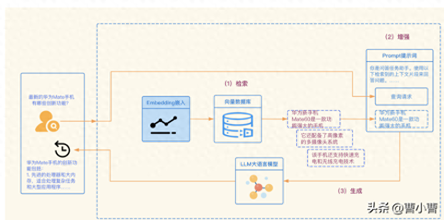
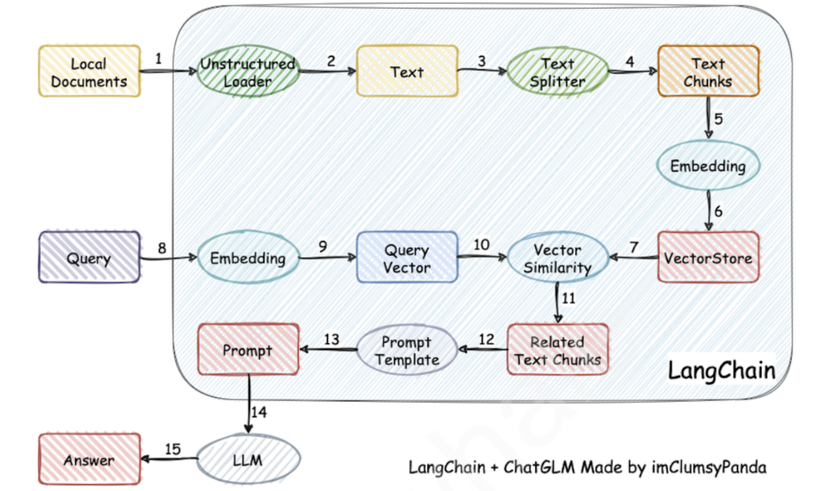
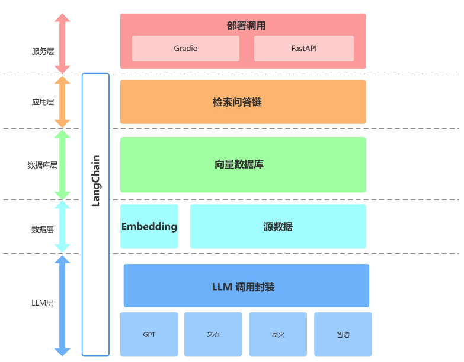

# 实战
- 环境
	- 硬件环境
		- CPU:i7-9700F
		- 显卡：GPU:2070S 8G
			- 单卡
			- 多卡
		- 内存:DDR4 32G

	- 软件环境
		- Windows
		- Ubuntu
		- Centos
		- Mac

- 如何从零训练一个大语言模型？
	- 案例：	手把手开发一个大预言模型
- 如何部署一个已经训练好的大模型？
	- 案例：搭建环境实现本地部署ChatGLM2 6B 大模型
- 如何基于chatGLM-6B模型预训练，添加自己的数据集微调？
	- 案例：基于chatGLM-6B模型预训练，添加自己的数据集微调
- 如何开发一个大模型应用？
	- 案例：	基于大模型构建个人知识库助手
- 如何开发一个简单的智能体系统？
	- 案例：Meta GPT

在提升大语言模型效果（解决大模型的幻觉问题）中，RAG 和 微调（Finetune）是两种主流的方法。

# 搭建一个基于大模型的**个人知识库助手**

## 项目地址
https://github.com/datawhalechina/llm-universe/tree/1.0/project

##项目目录结构 
- notebook：教程源码，可运行的 Notebook，更新频率最高，更新速度最快。
- docs：在线阅读版本，基于 notebook 源码订正。
- figures：图片文件。
- data_base：知识库文件和持久化向量数据库的地址。
- project：个人知识库助手项目代码。
- requirements.txt：环境依赖，请务必使用一致的版本号，避免版本更新带来的影响。

- 检索增强生成（Retrieval-Augmented Generation，RAG）
	- RAG借助**外挂的知识库**来为大语言模型提供准确和最新的知识，以提升大语言模型生成内容的质量，减少错误内容的产生。RAG允许对新增数据部分使用相同的模型处理，而无需调整及微调模型，从而极大地拓展了大模型的可用性。
	- RAG提供了一个有效的方式来解决在特定领域的问答，主要将行业知识转化为向量进行存储和检索，**通过知识检索的结果与用户问题结合形成Prompt**，最后利用大模型生成合适的回答。

## 整体流程
- 项目规划与需求分析
	- 项目目标：通过LangChain构建一个**RAG系统**
	- 核心功能
	- 技术架构和工具
		- 编程语言：python3.10
		- 数据库：Chroma知识库
		- 大模型：使用 GPT、科大讯飞的星火大模型、文心一言、GLM 等
		- 前后端：使用 Gradio 和 Streamlit
		- 流程的编排框架：LangChain 0.0.292框架
	- 实现流程
		- 数据准备与向量知识库构建
		- 大模型集成与API连接
		- 核心功能实现
		- 核心功能迭代优化
		- 前端与用户交互界面开发
		- 部署测试与上线
		- 维护与持续改进
	- 实现原理
		- 加载本地文档 -> 读取文本 -> 文本分割 -> 文本向量化 -> question向量化 -> 在文本向量中匹配出与问句向量最相似的 top k个 -> 匹配出的文本作为上下文和问题一起添加到 prompt中 -> 提交给 LLM生成回答

- 加载读取本地文档
- 数据清洗
- 文本分割
- 文本向量化
- 构建Chroma向量库
- 向量数据库检索
- 大模型的调用与封装
- prompt设计与构建
	- 设计原则
		- 编写清晰、具体的指令
		- 给予模型充足思考时间
	- 构建prompt

- 基于prompt模板构造检索式问答链
	- 什么是检索式问答链：一种通过检索步骤进行问答的方法。可以通过传入一个语言模型和一个向量数据库来创建它作为检索器。然后，我们可以用问题作为查询调用它，得到一个答案。

- 基于检索式问答链构造对话检索链（上下文的记忆功能）

##整体架构

项目从底向上依次分为 LLM 层、数据层、数据库层、应用层与服务层。

- ① LLM 层
	- 主要基于四种流行 LLM API 进行了 LLM 调用封装，支持用户以统一的入口、方式来访问不同的模型，支持随时进行模型的切换；
- ② 数据层：
	- 数据层主要包括个人知识库的源数据（包括 pdf、txt、md 等）和 Embedding 对象。源数据需要经过 Embedding 处理才能进入向量数据库，我们在数据层自定义了智谱提供的 Embedding API 的封装，支持上层以统一方式调用智谱 Embedding 或 OpenAI Embedding。
- ③ 数据库层
	- 主要为基于个人知识库源数据搭建的向量数据库，在本项目中我们选择了 Chroma；
	- 数据库层主要存放了向量数据库文件。同时，我们在该层实现了源数据处理、创建向量数据库的方法。
- ④ 应用层
	- 为核心功能的最顶层封装，我们基于 LangChain 提供的检索问答链基类进行了进一步封装，从而支持不同模型切换以及便捷实现基于数据库的检索问答；
- ⑤ 服务层
	- 分别实现了 Gradio 搭建 Demo 与 FastAPI 组建 API 两种方式来支持本项目的服务访问。

##代码结构
###本项目的完整代码存放于 project 目录下，实现了项目的全部功能及封装，代码结构如下：

- project
    - readme.md 项目说明
    - llm LLM调用封装
        - self_llm.py 自定义 LLM 基类
        - wenxin_llm.py 自定义百度文心 LLM
        - spark_llm.py 自定义讯飞星火 LLM
        - zhipuai_llm.py 自定义智谱AI LLM
        - call_llm.py 将各个 LLM 的原生接口封装在一起
    - embedding embedding调用封装
        - zhipuai_embedding.py 自定义智谱AI embedding
    - data 源数据路径
    - database 数据库层封装
        - create_db.py 处理源数据及初始化数据库封装
    - chain 应用层封装
        - qa_chain.py 封装检索问答链，返回一个检索问答链对象
        - chat_qa_chian.py：封装对话检索链，返回一个对话检索链对象
        - prompt_template.py 存放多个版本的 Template
    - serve 服务层封装
        - run_gradio.py 启动 Gradio 界面
        - api.py 封装 FastAPI
        - run_api.sh 启动 API

##项目逻辑
- 用户：可以通过 run_gradio 或者 run_api 启动整个服务；
- 服务层调用 qa_chain.py 或 chat_qa_chain 实例化对话检索链对象，实现全部核心功能；
- 服务层和应用层都可以调用、切换 prompt_template.py 中的 prompt 模板来实现 prompt 的迭代；
- 也可以直接调用 call_llm 中的 get_completion 函数来实现不使用数据库的 LLM；
- 应用层调用已存在的数据库和 llm 中的自定义 LLM 来构建检索链；
- 如果数据库不存在，应用层调用 create_db.py 创建数据库，该脚本可以使用 openai embedding 也可以使用 embedding.py 中的自定义 embedding