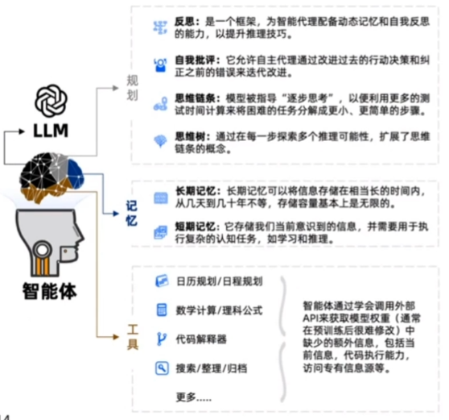
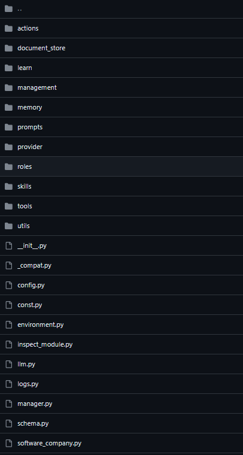
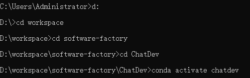
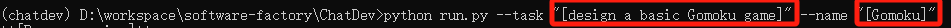
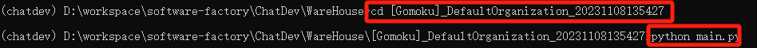
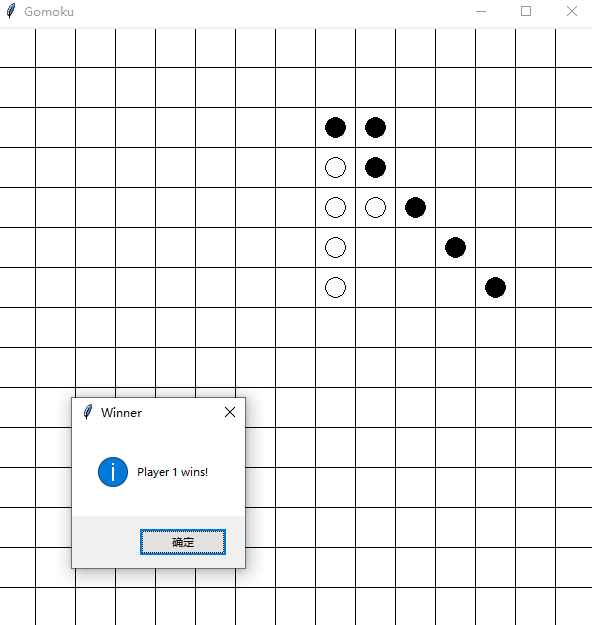
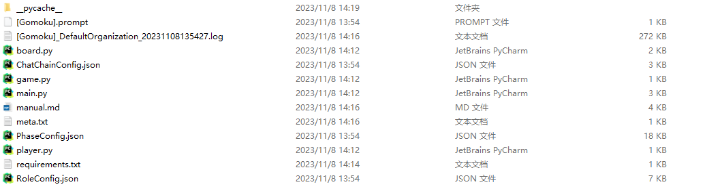

# 实战
- 环境
	- 硬件环境
		- CPU:i7-9700F
		- 显卡：GPU:2070S 8G
			- 单卡
			- 多卡
		- 内存:DDR4 32G

	- 软件环境
		- Windows
		- Ubuntu
		- Centos
		- Mac

- 如何从零训练一个大语言模型？
	- 案例：	手把手开发一个大预言模型
- 如何部署一个已经训练好的大模型？
	- 案例：搭建环境实现本地部署ChatGLM2 6B 大模型
- 如何基于chatGLM-6B模型预训练，添加自己的数据集微调？
	- 案例：基于chatGLM-6B模型预训练，添加自己的数据集微调
- 如何开发一个大模型应用？
	- 案例：	基于大模型构建个人知识库助手
- 如何开发一个简单的智能体系统？
	- 案例：Meta GPT

# 智能体
- Agent
	- **智能体 = LLM + 记忆（Memory：存储历史信息） + 规划（ReAct：执行流程/思维链、生成计划决策） + 工具（Tools：执行计划决策） **,各种不同的 AI Agent的差异与区别也几乎都从上述四部分展开
	
- Agent分类
	- **自主智能体（Autonomous Agent），单智能体**，其核心思想是“像人类智能一样去解决问题”，类似 AutoGPT 的智能体。
	- **生成智能体（Generative Agent），多智能体**，生成智能体的核心在于“像社会智能一样去解决问题”，以斯坦福小镇为代表。
- Agent与LLM的区别联系
	- Agent 与一般的 LLM 最大的不同点在于，LLM Agent 通常根据任务的总体目标来去指定以及编排子目标，而 LLM 通常是作为一个被调用的工具，在一个工作流中担任一个具体任务的执行者。
	- 目前和 LLMs 的交互基本都是这样的：人类输入 Prompt→LLMs 计算响应。每次如果想要新的响应都需要重新输入 Prompt，而这一步骤必须依靠人类主动触发。AI agents 则可以理解成一种不同的工作方式，它们可以自我提问、自行解决问题、举一反三以及自主行动，之后还可以自行确定行动的结果，作为人类，我们只需要一开始给定一个目标即可——比如说告诉它研究特定内容。面对一个“任务”，由人类站在高点描述一个“任务目标”，并将完成这一任务的工作交予 Agent，而 AI 接受目标并自主的进行**“感知环境”，“形成记忆”，“完成规划”，“决策行动”，“观察纠错”**等一系列以任务目标为导向的行动。
	-  AI可以分为预测性AI和生成性AI，下一代 AI 技术走向并非是生成性 AI，而应该是**交互性 AI**，Agent技术是未来实现社会全面自动化的关键技术
- 如何实现Agent
	- 基于构建LLM的智能体的框架与工具包（具备较强的二次开发能力）
		- **基于 LangChain , 利用LangChain的ReAct机制实现**
		- 基于Camel
	- 基于 Agents 多智能体框架
		- autogen
	- 基于开箱即用的专注于某些特定任务的智能体（二次开发能力相对较弱）
		- AutoGPT
		- MetaGPT
	- 此外，对于不会编程不想麻烦的可以，借助智能体开发平台，如国内的语聚AI、OpenAI的GPTs，这些平台把服务和接口直接写好了，用户直接在网页操作既可构建和发布智能体。

# 项目地址
https://github.com/KMnO4-zx/TinyAgent

# 6、几个相关的Agent项目
## 6.1 agents
- 项目地址：https://github.com/aiwaves-cn/agents
## 6.2 AutoGPT/AgentGPT
- 项目地址：https://github.com/Significant-Gravitas/AutoGPT
- 项目地址：https://github.com/reworkd/AgentGPT
## 6.3 open-interpreter
- 项目地址：https://github.com/KillianLucas/open-interpreter
## 6.4 AutoGen
- 项目地址：https://github.com/microsoft/autogen
- 是一个 LLMs **框架**，类似于 LangChain，主要用于简化 LLMs 工作流的编排、优化和自动化。它提供了可定制和可对话的 agents，并且对于人工参与度的支持非常好，可以在使用 LLMs、人工输入和工具组合的各种模式下运行。
## 6.5 AgentVerse
- 项目地址：github.com/OpenBMB/AgentVerse
- 论文地址：arxiv.org/abs/2308.10848
## 6.6 Meta GPT
- 项目地址：https://github.com/geekan/MetaGPT
- 论文地址：https://arxiv.org/pdf/2308.00352.pdf
- 案例演示：
	- 环境
		- win10（cmd）
		- Anaconda(python3.10)
		- git工具
		- 科学上网工具
		- OPENAI的api_key(本文采用GPT4模型)
		- npm工具
	- 步骤
		- 第一步：克隆仓库到某个文件夹下，如在D:\workspace\software-factory下执行
			- git clone https://github.com/geekan/metagpt
		- 第二步：创建anaconda环境并激活
			- conda create -n metagpt python=3.10
			- conda activate metagpt
		- 第四步：到项目文件夹下，安装依赖包
			- npm install -g @mermaid-js/mermaid-cli
			- python setup.py install
			- pip install -r requirements.txt
		- 第五步：**配置OPENAI的密钥，在 MetaGPT/config 目录中，创建 key.yaml文件，填入自己的OpenAI的API key和OPENAI_API_BASE 参数**，或者直接在config 目录中的config.yaml文件进行配置，或者在cmd窗口输入以下命令：
			- set OPENAI_API_KEY=your_api_key
			- set OPENAI_API_BASE = your_api_base
		- 第六步：构建软件
			- python startup.py "Write a cli snake game"
			- 定制化需求
				- 在win10操作系统环境下，基于python3.10解释器，爬取豆瓣电影Top250的相关信息，包括电影详情链接,图片链接,影片中文名,影片外国名,评分,评价数,概况,导演,主演,年份,地区,类别这12项内容，并将爬取的信息写入Excel表中
- 项目文件：
	- startup.py：代码入口，可以设置想花多少钱，需要几个角色合作……
	- actions：使用 PROMPT 方式，通过调用 GPT 和其它 API 实现了具体的功能，比如：写代码、分析库依赖、文本转语音、运行代码、测试……
	- document_store：各种存储的支持，faiss, milvus, chromadb向量数据库，本地存储，各种模式数据的读取，
	- management：管理所有技能
	- memory：管理存储
	- prompts：管理各种角色的提示
	- provider：调用大语言模型，目前支持Claude和OpenAI
	- roles：各角色的具体实现和相关工具，角色包含：工程师，架构师，产品，项目管理……
	- tools & utils：辅助工具

		

- 实现原理：角色定义、SOP程序化、信息共享机制
	- 在系统中定义了几种角色，并为每种角色配备了目标和prompt模板，以此引导相关角色解决相应问题，这些角色都有自己的目标以及输入和输出，为每种角色定义了一个单独的“**进程**”运行，每个角色会**监听**有关自己的任务输入。每一个角色在运行中都是**等待**是否有相应的输入出现，一旦观察到相应的输入就会立马根据自己的目标，使用大模型来解决这个问题（作出行动），并将结果返回到系统中。
		- 产品经理
			- 目标：创造一个成功的产品
			- 观察的输入：观察老板是否有新的需求
			- 可以的行动：写产品需求文档
		- 架构师
			- 目标：根据产品需求文档设计系统架构
			- 观察到输入：观察产品经理是否有新需求
			- 可以的行动：写设计文档
		- 项目经理
			- 目标：提升团队的效率
			- 观察的输入：观察是否有新的设计任务
			- 可以的行动：根据设计文档完成任务分解
		- 工程师
			- 目标：根据项目经理分解的任务完成代码和评审
			- 观察的输入：观察项目经理分解的任务
			- 可以的行动：写代码/代码评审
		- QA工程师
			- 目标：根据代码的输出和测试代码输出以及运行结果输出测试方案
			- 观察的输入：代码的运行结果
			- 可以的行动：写测试用例
	- 这些角色**能力和技能都是一个单独的文件**，**每一个py文件里面定义的都是对应技能的prompt模板**，每一个角色都可以通过引入这种技能来增强自己的能力，最终各个角色都是通过自己所有的这些技能来处理输入和输出，完成任务：
		- 分析代码库：analyze_dep_libs.py
		- azure的语音合成：azure_tts.py
		- debug：debug_error.py
		- 设计api：design_api.py
		- api评审：design_api_review.py
		- 设计文件名：design_filenames.py
		- 项目管理：project_management.py
		- 代码运行：run_code.py
		- 搜索和摘要：search_and_summarize.py
		- 写代码：write_code.py
		- 写代码评审：write_code_review.py
		- 写需求说明书：write_prd.py
		- 写需求说明书评审：write_prd_review.py
		- 写测试用例：write_test.py

		

	- 整个过程通过python**协程异步并发**的方式运行
		- 入口是startup.py
			- 开一个公司（from metagpt.software_company import SoftwareCompany）
			- 雇佣不同的role（from metagpt.roles import (Architect,Engineer,ProductManager,ProjectManager,QaEngineer,)）
			- **会调用SoftwareCompany类的run方法（公司开始运行）**
		- software_company.py
			- **调用start_project方法**，以BOSS role通过publish_message方法输入一个需求message，这个message被丢到environment的memory中
			- **会调用environment对象的run方法（环境搭建，真正的入口）**
		- environment.py（环境，承载一批角色，角色可以向环境发布消息，可以被其他角色观察到）
			- **会调用各个role对象的run方法**（开始干活）
			- role的方法逻辑，role之间的交互
				- role通过publish_message方法向environment发message，message存在environment的memory中
				- 观察environment中的信息（_observe方法）
					- 从environment的memory中读取消息，然后在通过get_by_actions方法去获得由role的_watch方法指定的要观察的对象其某个action产生的message，作为self._rc.news，然后role将这些news存到role的memory中
				- 如果需要处理，也就是role通过_observe方法观察到了news，则进行处理并将结果发送回environment中（_react方法）
					- 调用_think方法：设置state
					- 调用_act方法：会从role（自己）的memory中获取需要的message，作为自己action的输入（作为prompt交给GPT处理），将结果存到自己role的memory中和environment的memory中
	
			

- 思考总结
	- MetaGPT是怎么抽象出的软件公司开发流程的？SOP具体在代码上是怎么实现的？
		- SOP就是不同role之间交互的顺序，比如产品经理需要BOSS的message作为他prompt的约束，而产品经理的产出是架构师的输入，不同角色间的输入输出，就是SOP。
	- MetaGPT是怎么抽象具体的职业的？比如产品经理是怎么抽象的?
		- 从职业这个角度讲，主要通过action和承接的message来抽象，比如产品经理，就抽象成，接收老板需求，产出产品需求文档，将需求文档给到架构师的对象，然后每个role生成的结果都会放到env中，其他人也可以看到（很多角色只有一个action，就不会用到env中的message）
	- MetaGPT中不同AI Agent是怎么交互的？
		- role通过_watch确定要从哪个role的哪个action中获得这个action的输出，具体获取的过程在_observer方法中，获得其他role的message后，如果当前的role有多个action可执行，则通过_think去选一个action（使用env的memory，即当前环境中发生的内容），再通过_act去具体的执行action，执行action时，会从role的memory中获取需要的message。
	- 从效果上看，MetaGPT输出的内容是比较格式化的，要做到这样的效果，prompt是怎么写的？
		- MetaGPT的prompt的设计形式值得学习，它主要使用MarkDown格式来设计prompt，多数prompt中都会有context、example，从而让GPT4更好的发挥zero-shot能力，想知道具体的，建议直接拉代码下来看。
	- MetaGPT 目前已经达到一个实用状态，已经能完成**小型**的软件需求，网友们使用MetaGPT完成了包括贪吃蛇、打砖块游戏、2048网页版、Flappy Bird及学生管理系统等软件的开发，十分实用。

- 存在的缺陷
	- 运行程序时，依赖的库需要手动安装
		- ModuleNotFoundError: No module named 'openpyxl'
	- 容易出现库的版本兼容问题，在写需求时应该注明python或其他语言的版本
		- ImportError: cannot import name 'url_quote' from 'werkzeug.urls' (D:\software\Anaconda3\envs\metagpt\lib\site-packages\werkzeug\urls.py)
		- 编码问题
	- 代码审查并不能检查出所以问题，比如导包
	- 程序最终也无法运行
	- 对此我对需求进行完善，并用GPT4模型进行实验

## 6.7 ChatDev
- 环境：
	- win11
	- Anaconda(python3.10)
	- git
	- 科学上网工具
	- OPENAI的api_key(本文采用GPT4模型)
- 步骤
	- 克隆GitHub存储库： 首先，使用在cmd命令工具下用以下命令克隆存储库：
		- git clone https://github.com/OpenBMB/ChatDev.git
		- 在D:\workspace\software-factory就会出现项目文件夹D:\workspace\software-factory\ChatDev
	- 设置Python环境： 使用以下命令创建anaconda环境chatdev，并激活环境：
		- conda create -n chatdev python=3.10
		- conda activate chatdev
	
		
	
	- 安装依赖项： 进入ChatDev目录并运行以下命令来安装必要的依赖项：
		- pip install -r requirements.txt
	
		
	
	- 设置OpenAI API密钥：在Windows系统cmd上：
		- set OPENAI_API_KEY=your_api_key
		- set OPENAI_API_BASE = your_api_base
	
		
	
	- 构建软件： 使用以下命令启动生成您的软件，将[design a basic Gomoku game]替换为您的想法描述，将[Gomoku] 替换为您想要的项目名称：
		- python run.py --task "[design a basic Gomoku game]" --name "[Gomoku]"
	
		
	
	- 运行软件： 生成后，在WareHouse 目录下的特定项目文件夹中找到您的软件，例如[Gomoku]_DefaultOrganization_20231108135427。在该目录中运行以下命令来运行软件：
		- cd WareHouse/[Gomoku]_DefaultOrganization_20231108135427
		- python main.py

		

- 结果
	- 运行效果
	
      		 

	- 项目文件夹
	
		

- 原理解析
	- 角色设定：CEO、CTO、CPO、Designer、Programmer、Reviewer、Tester
	- 开发流程设定：整个过程划分为设计、编码、测试和文档四个阶段
	- 工作驱动：聊天链（ChatChain）架构
	- 工作流程：
		- 设计阶段：
			- 由 CEO、CPO、CTO 三方会谈，
			- 从产品顶层出发，确定软件的主要功能形式、整体架构，以及开发语言
		- 编码阶段：
			- 由 CTO、Programmer和Designer主导本阶段工作。
			- 聊天链将此过程分解为多个子任务，通常由两个角色参与完成。例如， CTO 提出具体功能规格说明，程序员就生成 Python 代码。美工设计 GUI 界面，程序员将其与代码集成。
			- 关键技术
				- 使用面向对象的编程语言，其模块化和继承等特性可减少整个系统的代码冗余度。
				- 使用代码演化（Version Evolution）机制，通过 Git 版本控制，仅将最新版的源代码呈现给交流链的各个环节
				- 为了缓解代码幻觉问题，本文提出一种思维指示（Thought Instruction）的策略以缓解潜在的代码幻觉。
		- 测试阶段：
			- 由Programmer、Reviewer、Tester参与完成。
			- 先是代码评审（code review），其过程与人类活动相似，由同行查看代码以查漏补缺。然后是测试人员使用解释器验证软件功能，以黑盒测试的方式完成系统测试。
		- 文档阶段：
			- 由 CEO、CPO、CTO、Programmer来写
			- 文档包括运行环境依赖文件、用户手册等。
	- 驱动智能体交流对话的主要机制：
		- 角色专业化
		- 记忆流
		- 自我反思
- 特点
	- 支持自定义ChatChain、Phase和Role设置
	- 支持在线Log模式和重放模式
	- 适合研究群体agent智能任务
	- 简单，易于上手