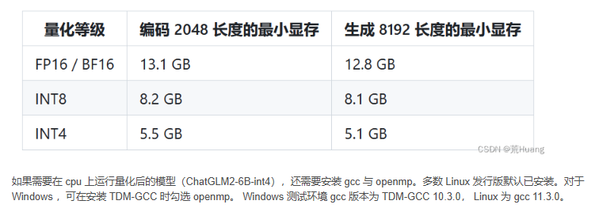

# 实战
- 环境
	- 硬件环境
		- CPU:i7-9700F
		- 显卡：GPU:2070S 8G
			- 单卡
			- 多卡
		- 内存:DDR4 32G

	- 软件环境
		- Windows
		- Ubuntu
		- Centos
		- Mac

- 如何从零训练一个大语言模型？
	- 案例：	手把手开发一个大预言模型
- 如何部署一个已经训练好的大模型？
	- 案例：搭建环境实现本地部署ChatGLM2 6B 大模型
- 如何基于chatGLM-6B模型预训练，添加自己的数据集微调？
	- 案例：基于chatGLM-6B模型预训练，添加自己的数据集微调
- 如何开发一个大模型应用？
	- 案例：	基于大模型构建个人知识库助手
- 如何开发一个简单的智能体系统？
	- 案例：Meta GPT

## ChatGLM-6B本地部署
chatglm2-6B是最近比较火爆的大模型，可以在消费级显卡上部署使用，适合学习。但是一般人也不一定有那么高的硬件配置，所以部署个int4版本应该是大多数人的最好选择。我就在家里部署起了int4版本的chatglm2-6B，ChatGLM2-6B 是开源中英双语对话模型 ChatGLM-6B 的第二代版本，在保留了初代模型对话流畅、部署门槛较低等众多优秀特性

- 环境准备
	- 硬件环境
		- 
	- 软件环境
		- python
		- anaconda(pytorch-gpu、)
		- git
		- TDM-GCC（可选）
- 下载chatglm2的源码，并安装它的依赖
- 下载chatglm2-int4的模型文件
- 模型使用（脚本文件配置修改）
	- cpu
	- gpu

## 利用特定的大模型部署工具进行部署
Ollama 是一个支持在本地运行大语言模型的工具，兼容 Windows 和 MacOS 操作系统。使用 Ollama，您仅需一行命令即可下载并启动模型。它简单方便使用，在本教程中我们使用 Ollama 来启动我们下载的 Lllama3 大模型。你可以把它理解为大语言模型的启动器。

## 利用谷歌云平台的服务进行部署