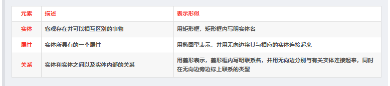
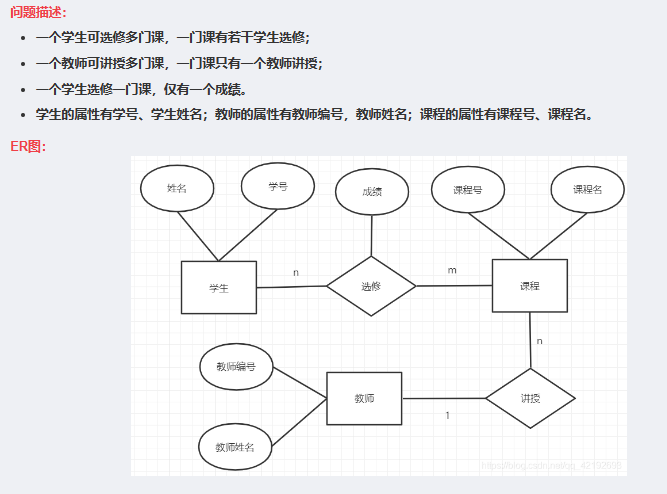

## Python连接并操作clickhouse数据库

```python

from clickhouse_sqlalchemy import make_session
from sqlalchemy import create_engine
import pandas as pd

conf = {
    "user": "admin",
    "password": "uzZYMa7Dguga1owoJo15",
    "server_host": "127.0.0.1",
    "port": "31459",
    "db": "data_mgmt"
}

connection = 'clickhouse://{user}:{password}@{server_host}:{port}/{db}'.format(**conf)
engine = create_engine(connection, pool_size=100, pool_recycle=3600, pool_timeout=20)

sql = 'SHOW TABLES'

session = make_session(engine)
cursor = session.execute(sql)
try:
    fields = cursor._metadata.keys
    df = pd.DataFrame([dict(zip(fields, item)) for item in cursor.fetchall()])
finally:
    cursor.close()
    session.close()

print(df)

```

## clickhoushe如何保留第一次的查询结果（建立临时表），在此基础上再做查询？
- 在 ClickHouse 中，可以使用 Temporary Tables（临时表）来保留第一次查询的结果，并在此基础上再做查询。临时表是一种只在当前会话中存在的表，可以使用 SELECT INTO TEMPORARY TABLE 语句创建，例如：
```
SELECT column1, column2 INTO TEMPORARY TABLE temp_table FROM table_name;
```

- 该语句会将 table_name 表中的 column1 和 column2 列的数据复制到 temp_table 临时表中。
- 接下来，可以在 temp_table 上执行查询操作，例如：

```
SELECT column1, COUNT(DISTINCT column2) FROM temp_table GROUP BY column1;
```

- 该语句会在 temp_table 临时表上执行分组计数统计，并返回结果。需要注意的是，临时表只在当前会话中存在，会话结束后会自动销毁，因此需要在同一会话中执行以上两个查询语句。


## 数据库的实体关系图（ERD）
在做数据分析前期，一定要对数据进行充分理解，数据包括的实体有哪些？实体之间的关系如何




## 数据类型
- 类别型数据=品质数据=定性数据
	- 分类型（分类型变量：如性别，取值只有男、女）——独热编码（One-Hot Encoding）
	- 顺序型（顺序型变量：如成绩等级，取值分为优良中差）——


- 数值型数据=数量数据=定量数据
	- 离散型（离散型数值变量：如车流量）——min-max标准化（Min-Max Normalization）
	- 连续型（连续型数值变量：如气温）——Z-score标准化


## 关系型数据/结构化数据/表格型数据
- 行(row)  = 样本（统计学、机器学习领域术语） = 元组/记录（数据库领域术语）
- 列(columns)  = 特征/变量（统计学、机器学习领域术语） = 字段（数据库领域术语）