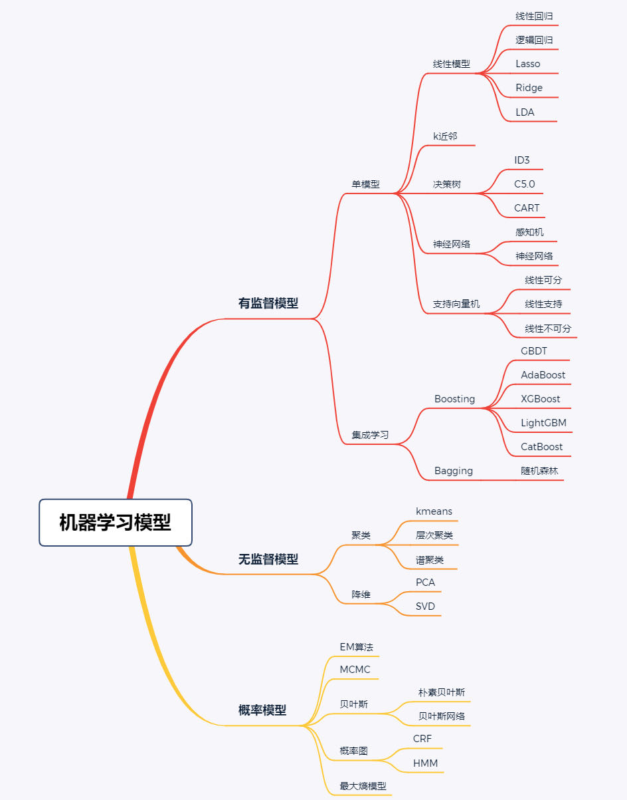
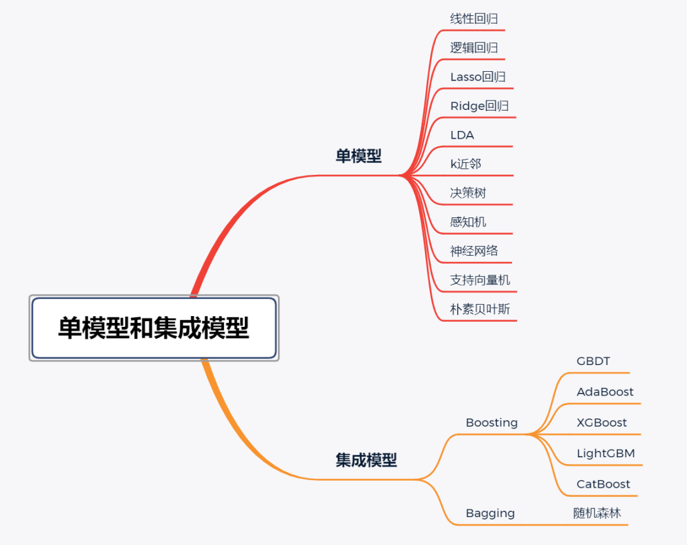
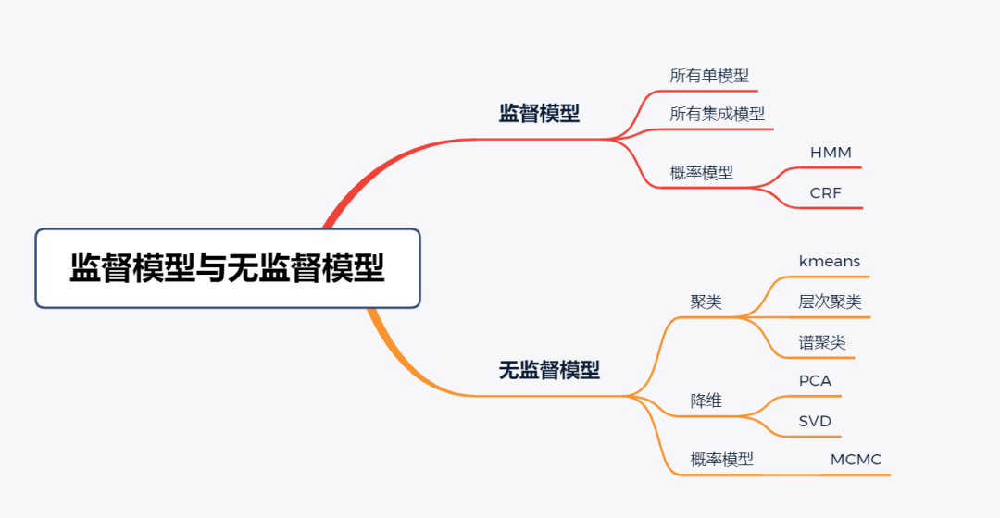
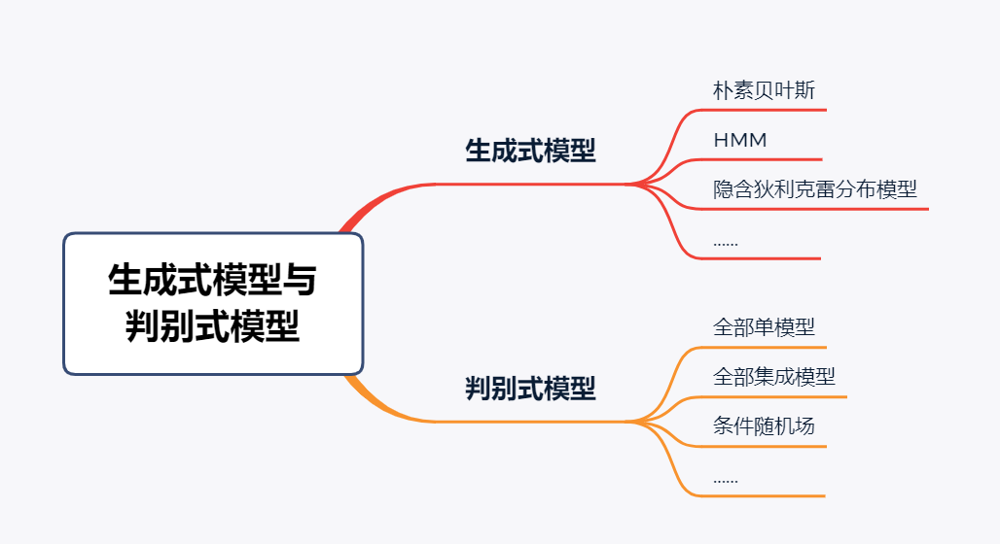
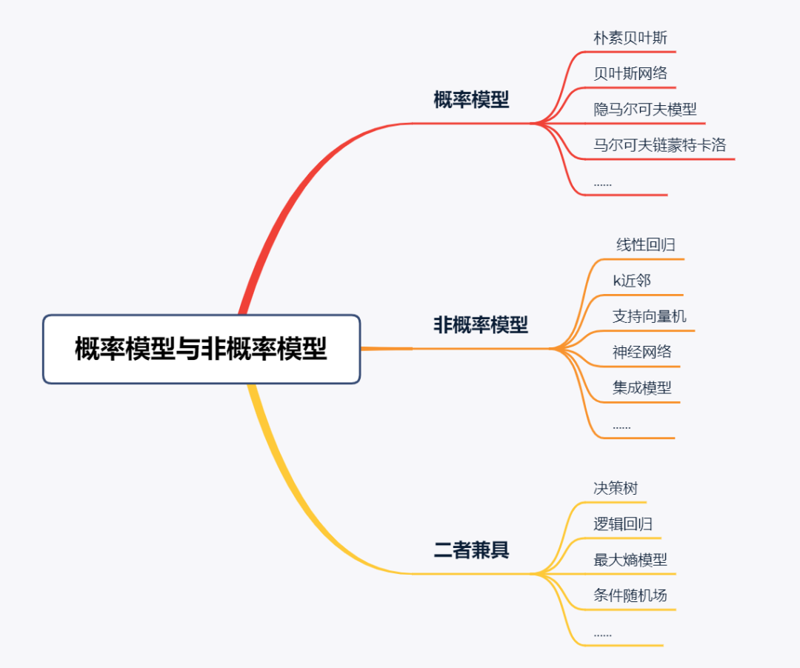

# 机器学习模型

#### 线性模型
- 数学原理：最小二乘法、正则化
- 常见的模型：
	- 线性回归
	- 逻辑回归
	- Lasso
	- Ridge
	- LDA
#### 决策树模型：
- 数学原理：信息熵
#### 神经网络模型：
- 数学原理：梯度下降、信息熵
### 支持向量机模型
### K近邻模型

## 机器学习模型分类
- 单模型和集成模型
	- 单模型，是指机器学习模型仅包括一个模型，以某种模型独立进行训练和验证使用的。监督学习模型中大多数模型都可以算作单模型，包括线性回归、逻辑回归、Lasso回归、Ridge回归、线性判别分析、近邻、决策树、感知机、神经网络、支持向量机和朴素贝叶斯等。
	- 与单模型相对立的，就是集成模型，集成模型就是将多个单模型进行组合构成一个强模型，这个强模型能取所有单模型之所长，达到一个相对的最佳性能。集成模型中的单模型既可以是同种类别的，也可以是不同类别的，总体呈现一种“多而不同”的特征。常用的集成模型包括Boosting和Bagging两大类，主要包括AdaBoost、GBDT、XGBoost、LightGBM、CatBoost和随机森林等模型。

- 有监督模型和无监督模型
	- 监督模型是指模型在训练过程中根据数据输入和输出进行学习，监督学习模型包括分类（classification）、回归（regression）和标注（tagging）等模型。
	- 无监督模型是指从无标注的数据中学习得到模型，主要包括聚类（clustering）、降维（dimensionality reduction）和一些概率估计模型。

- 生成式模型和判别式模型（有监督模型的进一步划分）
	- 生成式模型的学习特点在于学习数据的联合概率分布，然后基于联合分布求条件概率分布作为预测模型。常用的生成式模型包括朴素贝叶斯、隐马尔可夫模型以及隐含狄利克雷分布模型等。
	- 判别式模型的学习特点在于基于数据直接学习决策函数或者条件概率分布作为预测模型，判别式模型关心的是对于给定的输入，应该预测出什么样的。常用的判别式模型有很多，像线性回归、逻辑回归、Lasso回归、Ridge回归、线性判别分析、近邻、决策树、感知机、神经网络、支持向量机、最大信息熵模型、全部集成模型以及条件随机场等，都属于判别式模型。

- 概率模型和非概率模型
	- 通过对输入和输出之间的联合概率分布和条件概率分布进行建模的机器学习模型，都可以称之为概率模型。而通过对决策函数建模的机器学习模型，即为非概率模型。
	- 常用的概率模型包括朴素贝叶斯、隐马尔可夫模型、贝叶斯网络和马尔可夫链蒙特卡洛等，而线性回归、近邻、支持向量机、神经网络以及集成模型都可以算是非概率模型。
	- 需要注意的是，概率模型与非概率模型的划分并不绝对，有时候有些机器学习模型既可以表示为概率模型，也可以表示为非概率模型。比如说决策树、逻辑回归、最大熵模型和条件随机场等模型，就兼具概率模型和非概率模型两种解释。概率模型和非概率模型的划分如图5所示。

## 机器学习三大分支
- 监督学习
- 无监督学习
- 强化学习

## 机器学习流程

数据预处理->模型选择与构建->模型的训练和优化->模型的部署

## 分类预测模型的比较评价指标
- AUC（ROC面积）
- NRI（净重新分类指数）
- IDI（综合判别改善指数）
- YI（约登指数）