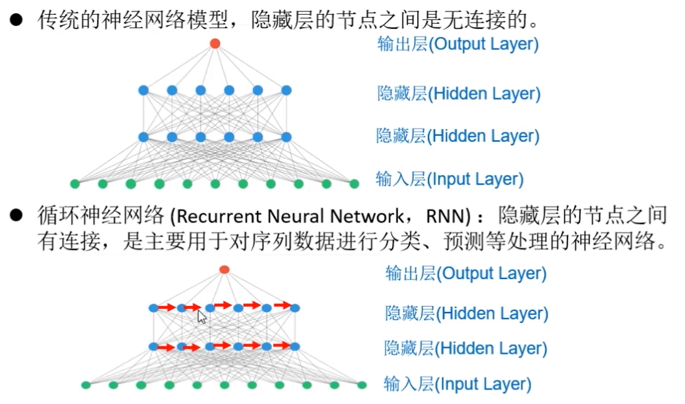
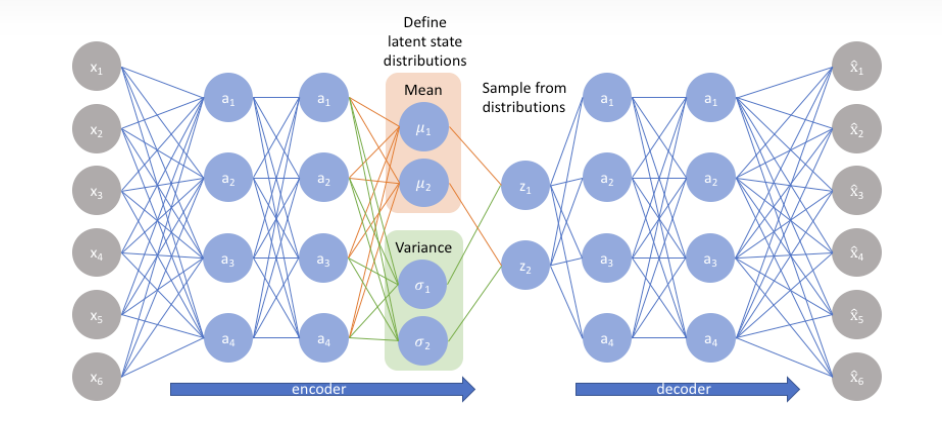
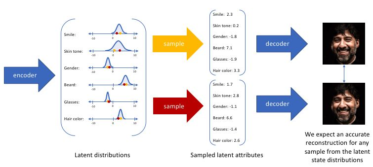
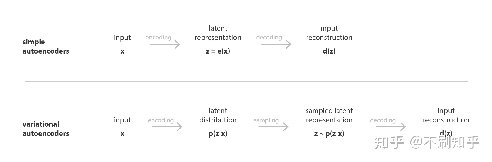
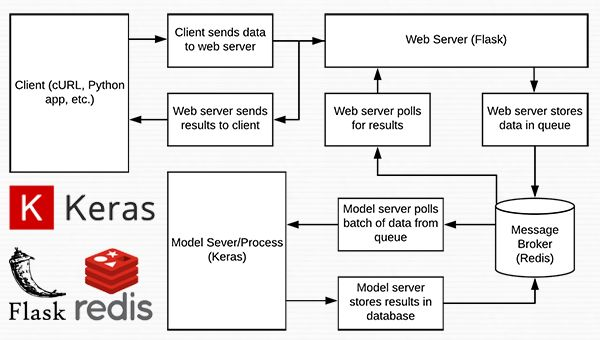

# 神经网络分类
- 人工神经网络（ANN）
	- 前馈神经网络（Feedforward NN）
		- 单层神经网络
		- 两层神经网络
		- 多层神经网络（DNN）
			- 全连接神经网络
			- 深度信念网络DBN
			- 卷积神经网络CNN
	- 反馈神经网络
		- 循环神经网络RNN
		- Hopfiled神经网络
	- 图网络
- 生物神经网络（BNN）

- 前馈：描述的是网络的结构，指的是网络的信息流是单向的，不会构成环路。在此种神经网络中，各神经元从输入层开始，接收前一级输入，并输出到下一级，直至输出层。整个网络中无反馈，可用一个有向无环图表示。前馈神经网络采用一种单向多层结构，其中每一层包含若干个神经元，同一层的神经元之间没有互相连接，层间信息的传送只沿一个方向进行。
- 人工神经网络（ANN）、前馈神经网络和BP神经网络的关系
	- 人工神经网络包括前馈神经网络，BP神经网络属于前馈神经网络的一种，在前馈神经网络的基础上应用了BP算法用来优化参数以学习并接近真实值。
## 1、感知机（perceptron）

## 2、多层感知机（FNN）
- 全连接神经网络
	- 前向传播
	- 反向传播

## 3、深度神经网络（DNN）
隐含层大于3层

## 4、卷积神经网络（CNN）
局部连接神经网络（局部信息感知，在更高层进行综合）

- 局部卷积
- 参数共享
- 多卷积核
- 池化处理
- 多层处理

## 5、循环神经网络（RNN，Recurrent Neural Network）
隐含层的节点之间有连接，是主要用于对**序列结构的信息**进行分类、预测、处理的神经网络

- 序列结构的信息
	- 人类的自然语言，是不是符合某个逻辑或规则的字词拼凑排列起来的，这就是符合序列特性。
	- 语音，我们发出的声音，每一帧每一帧的衔接起来，才凑成了我们听到的话，这也具有序列特性
	- 视频，
	- 股票，随着时间的推移，会产生具有顺序的一系列数字，这些数字也是具有序列特性。
- 词特征向量
	- One-Hot 编码：将每个词表示为一个由 0 和 1 组成的向量，向量的长度等于词汇表的大小。向量中只有一个位置为 1，表示该词在词汇表中的位置。
	- 词频（Term Frequency）：将每个词表示为一个向量，向量的每个维度表示该词在文本中出现的频率。
	- 词袋模型（Bag-of-Words）：将每个词表示为一个向量，向量的每个维度表示该词在文本中的存在与否（例如，0 表示不存在，1 表示存在）。
	- TF-IDF（Term Frequency-Inverse Document Frequency）：将每个词表示为一个向量，向量的每个维度表示该词在文本中的 TF-IDF 值，用于衡量该词在文本中的重要性。
	- Word2Vec：将词表示为一个低维度的实数向量，向量的每个维度表示词在语义空间中的位置，具有一定的语义关联性。

- RNN的变种
	- 长短时记忆网络（LSTM）----有门控装置：来控制每一时刻信息记忆和遗忘
	- 双向循环神经网络
	- 注意力机制
	- transfromer

## 6、递归神经网络（RNN，Recursive Neural Network）
递归神经网络通常是指结构递归神经网络，在空间维度展开，**处理的是树状结构的信息**

## 7、生成式神经网络
- 自动编码器（编码器+解码器）--------降维、压缩
- VAE（变分自编码器）
	- 变分自编码器便是用“取值的概率分布”代替原先的单值来描述对特征的观察的模型

- GAN（生成对抗网络）

# 激活函数
- 激活函数的作用
	- 引入非线性变换：激活函数引入非线性变换，使得神经网络能够学习和表示复杂的非线性关系。如果没有激活函数，多层神经网络将只能表示线性关系，无法解决复杂的模式识别和函数逼近问题。
	- 提供网络的非线性能力：激活函数赋予神经元非线性的激活特性，使得神经网络能够对输入数据进行非线性映射。这种非线性能力使得神经网络能够处理更加复杂的问题，如图像识别、语音处理和自然语言处理等。
	- 改善梯度传播：激活函数对于梯度传播（gradient propagation）的效果有很大影响。合适的激活函数可以缓解梯度消失（gradient vanishing）或梯度爆炸（gradient exploding）的问题，有助于更好地训练深层神经网络。
	- 稀疏激活性：某些激活函数（如ReLU函数）具有稀疏激活性，即只有部分神经元被激活，而其他神经元保持非激活状态。这种稀疏激活性有助于减少模型的复杂性和计算开销，并提高模型的泛化能力。
	- 非线性决策边界：激活函数可以帮助神经网络学习非线性决策边界。通过引入非线性变换，激活函数使得神经网络能够学习更加复杂和灵活的决策边界，从而提高模型的分类性能。
- 常见的激活函数：
	- Sigmoid函数：
		- Sigmoid函数是一种常用的激活函数，它将输入值映射到0到1之间的连续值。Sigmoid函数的公式为：
		- sigmoid(x) = 1 / (1 + exp(-x))
		- Sigmoid函数在过去被广泛使用，但由于其梯度饱和和输出不以零为中心的特点，近年来在深度神经网络中的应用逐渐减少。
	- 双曲正切函数（Hyperbolic Tangent，Tanh）：
		- 双曲正切函数是一种S型曲线激活函数，将输入值映射到-1到1之间的连续值。Tanh函数的公式为：
		- tanh(x) = (exp(x) exp(-x)) / (exp(x) + exp(-x))
		- Tanh函数在某些情况下比Sigmoid函数更常用，因为它的输出以零为中心，且梯度相对于输入更大。
	- ReLU函数（Rectified Linear Unit）：
		- ReLU函数是一种简单且常用的激活函数，它将负数映射到零，将正数保持不变。ReLU函数的公式为：
		- ReLU(x) = max(0, x)
		- ReLU函数在深度神经网络中非常流行，因为它简单有效，并且在训练过程中可以加速收敛。
	- Leaky ReLU函数：
		- Leaky ReLU函数是ReLU函数的一种变体，它在负数区域引入一个小的斜率，以解决ReLU函数在负数区域的梯度问题。Leaky ReLU函数的公式为：
		- Leaky ReLU(x) = max(0.01x, x)
		- Leaky ReLU函数在某些情况下可以避免“神经元死亡”问题，即神经元在训练过程中停止激活。

# 损失函数
- 损失函数的作用：衡量预测值与真实值之间的差异
- 参见的损失函数
	- 均方误差（Mean Squared Error，MSE）：
		- MSE是最常见的损失函数之一，用于回归问题。它计算预测值与真实值之间的平方差的平均值，可以表示为：
			- MSE = (1/n) * Σ(y_true-y_pred)^2
			- 其中，n是样本数量，y_true是真实值，y_pred是预测值。
	- 交叉熵损失（Cross-Entropy Loss）：
		- 交叉熵损失是用于分类问题的常见损失函数。它通过比较预测概率分布与真实标签的分布来衡量差异。对于二分类问题，交叉熵损失可以表示为：
			- Binary Cross-Entropy = (y_true * log(y_pred) + (1-y_true) * log(1-y_pred))
			- 对于多分类问题，交叉熵损失可以表示为：
				- Categorical Cross-Entropy = Σ(y_true * log(y_pred))
				- 其中，y_true是真实标签，y_pred是预测的概率分布。
	- 对数损失（Log Loss）：
		- 对数损失是二分类问题中常用的损失函数，特别适用于逻辑回归模型。它通过计算真实标签和预测概率之间的对数差异来衡量模型的性能。
	- KL散度损失（Kullback-Leibler Divergence Loss）：
		- KL散度损失是用于度量两个概率分布之间差异的损失函数。它常用于生成模型、变分自编码器等任务中。

# 优化器（优化方法/算法）
- 优化器的作用：寻找模型的最优解，得到最优解的参数
- 常见的优化器
	-梯度下降法(Gradient Descent)、	
		-随机梯度下降法SGD
		-批量梯度下降法BGD
	-动量优化法(Momentum)、		
	-自适应学习率优化算法
		-AdaGrad算法
		-RMSProp算法
		-Adam算法
		-lazyadam算法

## 神经网络的参数和超参数
- 模型参数（Model Parameters）：
	- 模型参数是神经网络中需要通过训练学习的参数，用于表示模型的权重和偏置。
	- 模型参数的数量取决于神经网络的体系结构，包括层数、每层的神经元数量等。
	- 模型参数直接影响模型的能力和拟合能力。
- 超参数（Hyperparameters）：
	- 超参数是在训练神经网络之前设置的参数，用于控制模型的结构和训练过程的配置。
	- 超参数不能直接通过训练数据学习，而是需要手动设置或通过试验和调整来确定。
	- 超参数的选择影响训练过程和优化算法的行为。
	- 一些常见的超参数包括
		- 学习率
		- 批量大小
		- 迭代次数
		- 正则化参数

# 模型部署
### 部署、扩展、管理一个能够提供预测能力的 REST API
- Keras+Redis+Flask + Apache 

- Keras+Flask+Docker+Kubernetes

### 流水线模型部署
- 深度学习框架-中间表示-推理引擎
	- PyTorch - ONNX - ONNX Runtime（把 PyTorch 编写的模型转换成 ONNX 模型，用 ONNX Runtime 运行模型，完成模型部署）

# Tensorflow
TensorFlow会将所有的步骤事先生成计算图graph，可以理解为流水线，然后在session中根据定义好的流水线逐步进行计算。特征x和样本真实值y通过占位符事先定义，能够更灵活地接收各维度数据的输入，所有的权重和偏置等需要求解的参数通过TensorFlow的variable定义，全部变量和网络定义好之后，通过session启动训练，并输出结果。