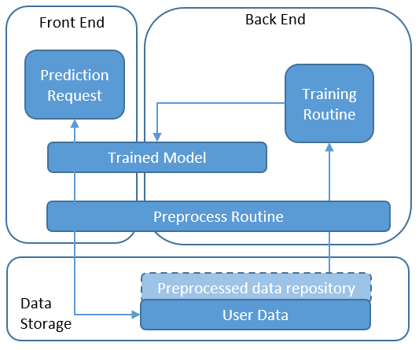
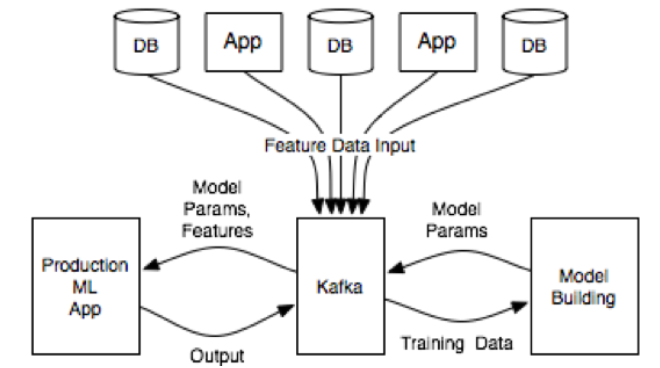

面对大量用户访问、高并发请求，海量数据，可以使用高性能的服务器、大型数据库，存储设备，高性能Web服务器，采用高效率的编程语言比如(Go,Scala)等，当单机容量达到极限时，我们需要考虑业务拆分和分布式部署，来解决大型网站访问量大，并发量高，海量数据的问题。

机器学习模型/深度学习模型/大语言模型/生产环境部署的四种系统架构总结

- 在数据库中存储预测
	- 在这种体系结构中，预测结果在预测阶段（模型预生成预测时）存储在数据存储中，并且当请求在应用程序端（前端）上发布时，将返回那些结果。

- 在模型对象上预测
	- 在这种架构中，经过训练的模型被放置在前端和后端共享的存储中。 前端收到预测请求后，它将获取预处理数据，并在模型上运行预测逻辑。 通过模型训练例程定期对模型进行重新训练并将其转储到存储中。

- 基于API预测
	- 在该架构中，预测由运行在API服务器上的API提供（例如通过Python Flask）或由无服务器功能（例如AWS Lambda或GCP Cloud Functions）托管。 API从存储中加载模型。 一旦收到请求，它将获得预处理的数据，运行预测并返回结果。 通过模型训练例程定期对模型进行重新训练并将其转储到存储中。

- 实时学习
	- 流数据（例如从物联网设备）实时传送到系统中，或当我们有特殊需要基于新到达的数据实时更新ML模型时，才需要这种体系结构。新的训练数据到达API网关并发送到预处理步骤。新数据通过消息传递功能（例如Apache Kafka）排队以将数据排队以进行下一步处理，并通过流功能（例如Spark Streaming）实时处理。接下来，处理后的数据将触发模型的重新训练，例如，使用sklearn或Spark MLlib。同时，可以响应前端请求经过预处理和预测来提供预测，就像“ 3架构”中所述。预测基于上面的API。总体架构可以使用更多受管编排服务（如Jubatas）来处理。这种架构使配置最复杂，并且需要其他架构中最有经验的架构师。
