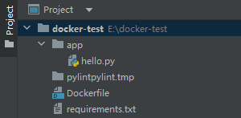
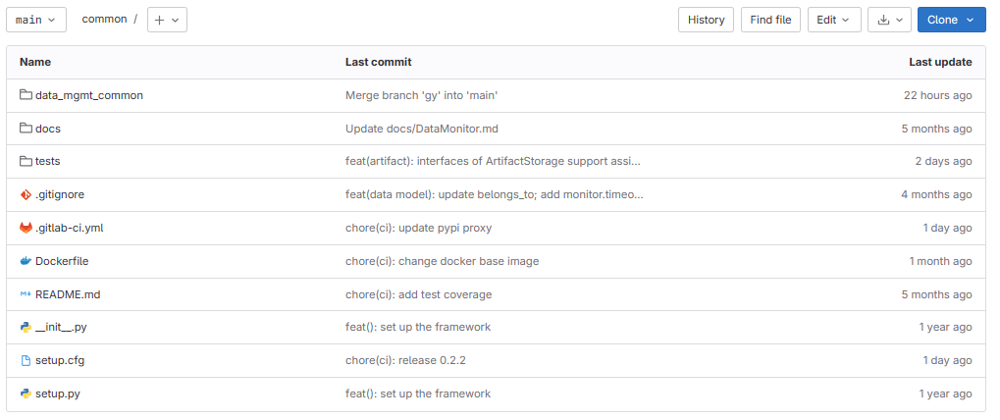

- 开发环境(操作系统)：本地127.0.01（windows）、远程IP（linux、centos...阿里云或者腾讯云购买服务器）
- 打包方式（软件包的几种形态）：打包成可执行exe文件、打包成安装包SDK、打包成docker镜像文件
- 部署方式：直接部署、docker容器化部署
- 上线：购买或租域名，绑定IP，备案


## win11 安装docker desktop(基于 WSL2 在 Windows 下使用 docker)
- 安装Hyper-V[windwos11没有Hyper-V的解决方法](https://www.jianshu.com/p/96aa6eeacb56)
- 启用Hyper-V
- [安装WSL](https://wslstorestorage.blob.core.windows.net/wslblob/wsl_update_x64.msi)
- 安装docker desktop installer，到[官网](https://docs.docker.com/desktop/windows/install/)上下载

## 将python项目（程序）打包(SDK)发布到Pypi
- 使得别人或自己能够用我的程序
- python生成sdk时，可以打包成.egg（windows下）也可以打包成.whl(linux或者windows下)，然后执行pip3 install ***.whl就可以像往常的安装包一样使用了。

## 将python项目（程序）打包docker镜像并运行
- 使得别人或自己在不同环境（机器）能够跑我的程序

- 假设我本地E盘下有一个项目docker-test，app目录(类似程序的根目录，一个包)下有一个hello.py脚本（一般情况下会有多个py甚至还有二级三级目录）



- 安装docker
	- 若想在本地windows环境运行，就得在windows中安装docker，分为桌面版和内核版
	- 若想在远程服务器Linux环境运行镜像，就得在Linux中安装docker，分为桌面版和内核版
- 将python项目打包为docker镜像
	- 导出程序依赖包（在docker-test目录下会生成requirements.txt）
		-  ```pip freeze > requirements.txt```
		-  ```pip install pipreqs
		     pipreqs .```
	- 编写Dockfile（在docker-test目录下新建一个dockerfile文件）

		```python

		FROM python:3.9.6  # 基于的基础镜像
		ADD . E:/docker-test # 本地项目添加到E:/docker-test文件夹
		WORKDIR E:/docker-test # 设置E:/docker-test文件夹是工作目录
		RUN pip install -r requirements.txt # 安装程序依赖包
		CMD ["python", "app/hello.py"]

		```

	- 制作镜像（运行之后本地就会生成一个镜像，在docker desktop里面就可以看到，内核版需要命令查看）
		- docker build -t imagename Dockerfilepath
			- 如：docker build -t demo:v0 .  
	- 运行镜像（运行镜像就是启动容器）（桌面版本直接点击运行，内核版需要敲命令行）
		- 本地运行:docker run -d --name c_name imagename
			- 如：docker run demo_f:v0
		- 上传到服务器，在服务器运行镜像
			- 保存镜像文件
			- 加载镜像文件
			- 执行镜像
	- 上传到docker hub，拉取镜像，修改镜像
		- 更改镜像名
		- 上传镜像
		- 拉取镜像

- 对于web平台或api开发、打包、部署完成之后需要上线发布（需要买一台服务器，进行域名配置，使得别人能够访问我的api或网页内容）

## windows本地借助docker安装部署clickhouse服务器，通过DBeaver访问本地服务器
- 1.1 安装docker
- 1.2 拉取docker镜像，进行部署配置（ip、port，用户名密码）
- 1.3 安装DBeaver
- 1.4 在docker里面启动clickhouse服务
- 1.5 在DBeaver连接clickhouse服务器


## Gitlab项目常见一些配置文件


- .gitignore
	- .gitignore 文件是一个用于指定 Git 版本控制系统忽略哪些文件和目录的配置文件。在提交代码到 Git 仓库时，.gitignore 文件中指定的文件和目录将被自动忽略，不会被包含在版本控制中。
	- .gitignore 文件通常用于指定一些不需要被版本控制的文件，例如编译产生的临时文件、日志文件、缓存文件等。这些文件通常不需要被提交到版本控制中，因为它们是可以被重新生成或重建的，并且它们的变化可能会干扰其他开发人员的工作。
	- 要创建 .gitignore 文件，您可以在项目的根目录下创建一个名为 .gitignore 的文件，并在其中列出您想要忽略的文件和目录。每个文件或目录应该占据一行，并且可以使用通配符来匹配多个文件或目录。
- Dockerfile
- README.md
- setup.cfg
	- setup.cfg 文件是一个用于配置 Python 包的设置文件。它通常用于定义包的元数据、依赖项、构建选项和其他相关配置。
- setup.py
- __init__.py
- .gitlab-ci.yml

## 容器和镜像的区别和联系
- **镜像是一个静态的、可执行的软件包，它包含了运行特定应用程序所需的所有文件、依赖项、配置和环境**。镜像可以看作是一个只读的模板或快照，它可以用来创建多个相同的容器实例。镜像是构建容器的基础，它可以被存储、共享和版本控制。常见的镜像仓库如Docker Hub和Docker Registry。
- **容器是镜像的运行实例，它是一个独立、轻量级的运行环境，可以在其中运行应用程序**。容器提供了隔离的运行环境，使得应用程序可以在不同的主机上以相同的方式运行，无论主机的操作系统和配置如何。容器可以启动、停止、暂停、删除等操作，它们可以相互通信和共享资源，但彼此之间是隔离的。
- 镜像和容器之间的联系在于，**容器是基于镜像创建的运行实例。容器使用镜像作为其文件系统和运行时环境，镜像中的文件和配置会被加载到容器中，并在容器中执行应用程序**。通过使用相同的镜像，可以创建多个相同的容器实例，每个容器都是相互隔离的。
- 区别上来说，镜像是静态的，它是一个不可变的文件，而容器是动态的，它是一个运行中的实体。镜像是构建和发布的阶段，而容器是部署和运行的阶段。镜像通常用于构建和分发应用程序，而容器用于在不同的环境中运行应用程序。
- 总结起来，镜像是容器的基础，它提供了应用程序运行所需的一切，而容器是镜像的运行实例，它提供了隔离的运行环境。通过镜像，可以创建和管理多个相同的容器实例，从而实现应用程序的部署和运行。
