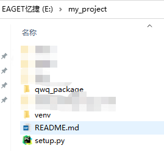
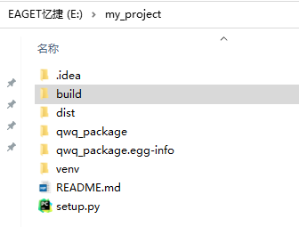

# 软件开发交付流程：
#### 需求分析------->系统设计-------->编码----->构建------->测试------->部署------->上线-------->维护


- 开发环境(操作系统)：
	- 本地127.0.01（windows）、
	- 远程IP（linux、centos...阿里云或者腾讯云购买服务器）
- 需求分析
	- 理解用户需求、定义系统功能和性能要求，并将其记录为软件需求规格说明书
- 系统设计
	- 定义系统的架构、模块划分、数据结构和算法设计等。系统设计还可能涉及用户界面设计、数据库设计和网络通信设计等方面。
- 编码与单元测试
	- 编码阶段将系统设计转化为实际的源代码，并遵循编码规范和最佳实践进行开发。
	- 单元测试是针对单个模块或组件的测试，以验证其功能的正确性。
- 构建（Build）：是指将源代码和相关资源转化为可执行软件的过程。它是将程序源代码、配置文件、库文件等组合在一起，并经过编译、链接、打包等操作，生成最终可运行的软件的过程。构建过程通常包括以下步骤：
	- 编译（Compile）：将源代码转换为机器可执行的二进制代码。编译器将源代码逐行解析并生成相应的机器指令，生成目标文件或可执行文件。
	- 链接（Link）：将编译生成的目标文件与库文件进行链接，生成最终的可执行文件。链接器将不同的目标文件合并，并解决函数和变量之间的引用关系，生成一个完整的可执行程序。
	- 打包（Packaging）：将可执行文件和其他必要的资源（如配置文件、图像、音频等）打包成一个发布或部署所需的软件包。打包的形式：
		- 打包成可执行exe文件（二进制可执行文件）
		- 打包成安装包SDK
		- 打包成docker镜像文件
		- 打包成安装程序APK
- 测试
	- 集成测试旨在验证各个模块之间的接口和交互是否正常
	- 系统测试则测试整个系统是否满足需求规格说明书中的功能和性能要求
- 部署（程序在服务器运行）
	- 直接部署(服务器需要有nginx+uwsgi相关的配置)
	- docker容器化部署(服务器需要有nginx+uwsgi相关的配置)
- 上线
	- 购买服务器
	- 租域名，绑定IP
	- 备案


## win11 安装docker desktop(基于 WSL2 在 Windows 下使用 docker)
- 安装Hyper-V[windwos11没有Hyper-V的解决方法](https://www.jianshu.com/p/96aa6eeacb56)
- 启用Hyper-V
- [安装WSL](https://wslstorestorage.blob.core.windows.net/wslblob/wsl_update_x64.msi)
- 安装docker desktop installer，到[官网](https://docs.docker.com/desktop/windows/install/)上下载

## 将python项目（程序）打包发布到Pypi
- 使得别人或自己能够用我的程序
- python生成sdk时，可以打包成.egg（windows下）也可以打包成.whl(linux或者windows下)，然后执行pip3 install ***.whl就可以像往常的安装包一样使用了。
- 具体步骤：
	- 组织项目的目录结构
	
			```
			<my_project>/                 # 项目根目录
			|-- <my_package>           # 包（程序）package的根目录
			|   |-- __init__.py
			|   `-- func.py         		 # 代码模块
			|-- README.md
			|-- LICENSE
			|-- setup.cfg
			|-- setup.py
			```

		- func.py文件中是我们的核心代码。
		- README.md是关于项目的描述文件，一般包含怎样安装项目，怎样使用项目等。
		- LICENSE是开源License，如MIT，Apache license 2.0等
		- setup.cfg是一个配置信息文件，运行setup.py程序打包的时候会用到里面的配置，作为setup.py的命令行参数。
		- setup.py用来描述我们的项目，之后打包的时候会用到这个文件。它告诉PyPI我们的项目叫什么名字，是什么版本，依赖哪些库，支持哪些操作系统，可以在哪些版本的Python上运行，等等。
	- 编写配置说明文件
		- README.md
		- LICENSE
		- setup.cfg
		- setup.py
	- 打包项目
		- pip3 install setuptools
		- pip3 install wheel
		- python3 setup.py sdist bdist_wheel
		- 上面的命令会在dist/目录下生成一个tar.gz的源码包和一个.whl的Wheel包。
	- 创建PyPI账户
	- 上传项目（包）
		- pip3 install twine
		- twine upload dist/*  或 twine upload --username __token__  --password your-api-token dist/*
	- 从PyPi中pip安装
		- from qwq_package import mymodule
		- print(mymodule.add(1, 2))





## 将python项目（程序）打包docker镜像并运行
- 使得别人或自己在不同环境（机器）能够跑我的程序
- 假设我本地E盘下有一个项目docker-test（项目的根目录），app目录(类似程序的根目录，一个包)下有一个hello.py脚本（一般情况下会有多个py甚至还有二级三级目录）


- 安装docker
	- 若想在本地windows环境运行，就得在windows中安装docker，分为桌面版和内核版
	- 若想在远程服务器Linux环境运行镜像，就得在Linux中安装docker，分为桌面版和内核版
- 将python项目打包为docker镜像
	- 导出程序依赖包（在docker-test目录下会生成requirements.txt）
		-  ```pip freeze > requirements.txt```
		-  ```pip install pipreqs
		     pipreqs .```
	- 编写Dockfile（在docker-test目录下新建一个dockerfile文件）

		```python

		FROM python:3.9.6  # 基于的基础镜像
		ADD . E:/docker-test # 本地项目添加到E:/docker-test文件夹
		WORKDIR E:/docker-test # 设置E:/docker-test文件夹是工作目录
		RUN pip install -r requirements.txt # 安装程序依赖包
		CMD ["python", "app/hello.py"]

		```
	- 制作镜像（运行之后本地就会生成一个镜像，在docker desktop里面就可以看到，内核版需要命令查看）
		- docker build -t imagename Dockerfilepath
			- 如：docker build -t demo:v0 . 
		-  默认情况下，Docker镜像存储在Docker引擎的默认存储位置。在Windows上，它通常位于C:\ProgramData\Docker\windowsfilter目录下。在这个目录中，你可以找到以哈希值命名的文件夹，每个文件夹对应一个镜像。在Windows上，如果你使用的是Docker Desktop（Docker for Windows），默认情况下，镜像存储在WSL 2的虚拟机文件系统中。 
	- 运行镜像（运行镜像就是启动容器）（桌面版本直接点击运行，内核版需要敲命令行）
		- 本地运行:docker run -d --name c_name imagename
			- 如：docker run demo_f:v0
		- 上传到服务器，在服务器运行镜像
			- 保存镜像文件
			- 加载镜像文件
			- 执行镜像
	- 上传到docker hub，拉取镜像，修改镜像
		- 更改镜像名
		- 上传镜像
		- 拉取镜像

- 对于web平台或api开发、打包、部署完成之后需要上线发布（需要买一台服务器，进行域名配置，使得别人能够访问我的api或网页内容）

## windows本地借助docker安装clickhouse（服务端），通过DBeaver访问本地服务器
在Windows环境中安装一个Dokcer是为了便于我们在自己的Windows开发环境中快速打搭建你所需要的开发运行的软件环境，比如说有时候你本地需要在Windows10开发环境中快速搭建一个clickhouse的运行环境，但是大家在Windows环境安装过的都知道clickhouse安装快则半个到一个小时，忙的话就是两三个小时不等。但是你使用Docker的话，下载镜像到运行容器，在到配置可能就是十多分钟的功夫吧。


- 1.1 安装docker
- 1.2 拉取docker镜像，进行部署配置（ip、port，用户名密码）
- 1.3 安装DBeaver
- 1.4 在docker里面启动clickhouse服务
- 1.5 在DBeaver连接clickhouse服务器

## Git项目常见一些配置文件


- .gitignore
	- .gitignore 文件是一个用于指定 Git 版本控制系统忽略哪些文件和目录的配置文件。在提交代码到 Git 仓库时，.gitignore 文件中指定的文件和目录将被自动忽略，不会被包含在版本控制中。
	- .gitignore 文件通常用于指定一些不需要被版本控制的文件，例如编译产生的临时文件、日志文件、缓存文件等。这些文件通常不需要被提交到版本控制中，因为它们是可以被重新生成或重建的，并且它们的变化可能会干扰其他开发人员的工作。
	- 要创建 .gitignore 文件，您可以在项目的根目录下创建一个名为 .gitignore 的文件，并在其中列出您想要忽略的文件和目录。每个文件或目录应该占据一行，并且可以使用通配符来匹配多个文件或目录。
- **Dockerfile**
- README.md
- setup.cfg
	- setup.cfg 文件是一个用于配置 Python 包的设置文件。它通常用于定义包的元数据、依赖项、构建选项和其他相关配置。
- **setup.py**
- __init__.py
- .gitlab-ci.yml
	- 是GitLab中用于配置持续集成/持续部署（CI/CD）流程的文件。它定义了一系列的阶段、任务和操作，以实现自动化构建、测试和部署项目的流程。

## 容器和镜像的区别和联系
- **镜像是一个静态的、可执行的软件包，它包含了运行特定应用程序所需的所有文件、依赖项、配置和环境**。镜像可以看作是一个只读的模板或快照，它可以用来创建多个相同的容器实例。镜像是构建容器的基础，它可以被存储、共享和版本控制。常见的镜像仓库如Docker Hub和Docker Registry。
- **容器是镜像的运行实例，它是一个独立、轻量级的运行环境，可以在其中运行应用程序**。容器提供了隔离的运行环境，使得应用程序可以在不同的主机上以相同的方式运行，无论主机的操作系统和配置如何。容器可以启动、停止、暂停、删除等操作，它们可以相互通信和共享资源，但彼此之间是隔离的。
- 镜像和容器之间的联系在于，**容器是基于镜像创建的运行实例。容器使用镜像作为其文件系统和运行时环境，镜像中的文件和配置会被加载到容器中，并在容器中执行应用程序**。通过使用相同的镜像，可以创建多个相同的容器实例，每个容器都是相互隔离的。
- 区别上来说，镜像是静态的，它是一个不可变的文件，而容器是动态的，它是一个运行中的实体。镜像是构建和发布的阶段，而容器是部署和运行的阶段。镜像通常用于构建和分发应用程序，而容器用于在不同的环境中运行应用程序。
- 总结起来，镜像是容器的基础，它提供了应用程序运行所需的一切，而容器是镜像的运行实例，它提供了隔离的运行环境。通过镜像，可以创建和管理多个相同的容器实例，从而实现应用程序的部署和运行。

## Python 常用配置文件处理
- 配置文件是为程序配置参数和初始设置的文件。一般为文本文件，以ini,conf,cnf,cfg,yaml等作为后缀名。例如mysql的配置文件my.cnf内容如下：

```
[mysqld]
bind-address = 0.0.0.0
mysqlx-bind-address = 127.0.0.1
default_authentication_plugin = mysql_native_password
```

- 解析配置文件
	- ConfigParser模块
		- python提供内置库ConfigParser用来解析ini格式的配置文件。
	- pyyaml模块
		- python解析yaml文件需要安装第三方库pyyaml。它会将整个yaml配置文件内容解析成一个python字典返回。

## python 源码包和二进制包有什么区别

- Python 包的分发可以分为两种：
	- 源码包（Source Distribution）：源码包是Python源代码的压缩包，通常以.tar.gz或.zip格式发布。安装源码包需要先将源代码编译成二进制代码，然后才能在系统上运行。源码包通常包含setup.py文件和setup.cfg文件，用于安装和配置Python包。
	- 二进制包（Binary Distribution）：二进制包是已经编译好的Python可执行文件，通常以操作系统特定的格式（如.exe、.dmg、.rpm、.deb等）发布。安装二进制包不需要编译源代码，可以直接在系统上运行。二进制包通常包含预编译的Python解释器和相关的库文件，以及一些预装的Python模块。

## nginx+uwsgi
- Nginx（发音为"engine-x"）是一个高性能的**开源Web服务器软件**，也可以用作反向代理服务器、负载均衡器和HTTP缓存等。它以轻量级和高并发能力而闻名，并且在处理静态文件和高并发请求方面非常出色。Nginx**通常用于前端服务器**，接收来自客户端的HTTP请求，并将请求转发给后端的应用服务器处理。
- uWSGI是一个**Web应用程序服务器**，用于将Web应用程序与Web服务器（如Nginx）连接起来。它充当应用服务器，负责接收来自Web服务器的请求，并将请求转发给相应的Web应用程序进行处理。uWSGI支持多种编程语言和Web框架，包括Python、Django、Flask等。


## 框架、标准库、API的区别
- 框架是一个软件平台，提供了一套规范和工具来帮助应用程序的开发；**如Django、Flask和Pyramid**
- 标准库是Python官方提供的一组模块和功能，用于常见任务的处理；**如os、datetime、math等**
- API是一组定义了不同软件组件之间交互的规范和方法，用于与第三方库或服务进行通信。**如，社交媒体平台的API允许开发者访问和操作用户数据，支付服务的API允许开发者进行支付操作等。**


## SDK
- SDK（Software Development Kit）是一套用于开发软件的**工具集合**，通常**由平台或服务提供商提供**。它包含了开发所需的工具、库、文档和示例代码，以便开发人员能够更轻松地构建应用程序。
- 以下是一些常见的SDK示例：
	- Android SDK：用于开发Android应用程序的工具集合，包括开发工具、调试器、库和文档等。
	- iOS SDK：用于开发iOS应用程序的工具集合，包括开发工具、调试器、库和文档等。
	- Google Maps SDK：用于开发与Google地图集成的应用程序的工具集合，提供了访问和使用Google地图的功能。


##   requirements.txt 和 setup.py/setup.cfg
- 如果主要用于项目开发目的，并且不打算发布到pypi上，则 requirements.txt 就足够了（即使该包是在多台机器上开发的）
- 如果包仅在单机开发（别人不需要运行你的项目），但是需要把他作为pip的包发布到pypi上，那么 setup.py/setup.cfg 就足够了。
- 如果包是在多台机器上开发（别人需要运行你的项目）的并且还需要把他发布到pypi上，这就需要 requirements.txt （多个机器需要相同的开发环境）和 setup.py/setup.cfg 文件（发布到pypi上）。